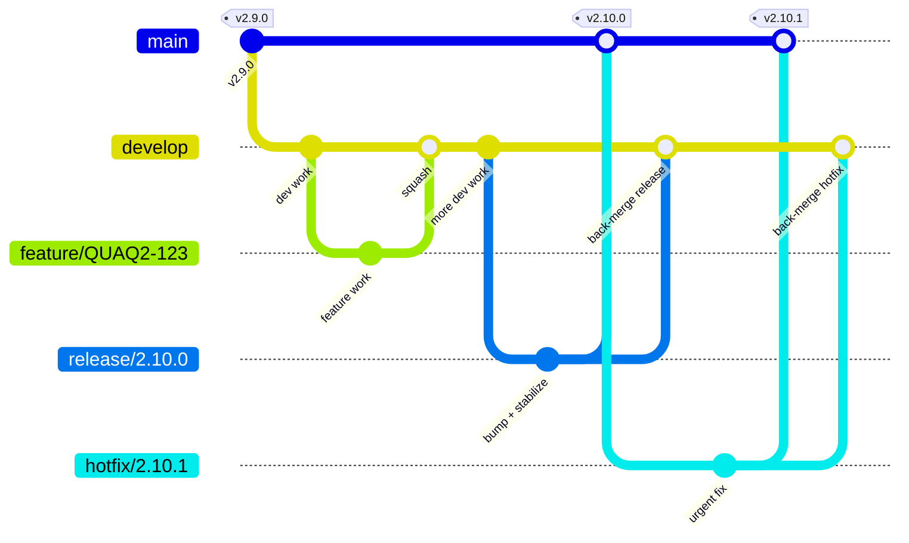

# Welcome to the koalixcrm 
## Why koalixcrm
<table><tr><th>Values:</th><th>Features:</th></tr>
<tr><td><ul>
 <li><b>Free and open</b></li>
 <li>REST interface to many entities </li>
 <li>Open source </li>
 <li>BSD license </li>
<li>Simple and beautiful user interface </li>
<li>High quality output documents </li>
<li>Small business <10 employees with access </li>
                       <li>Cloud hosted, Self-hosted, Not hosted (single-user, offline)</li></ul></td>
<td><ul>
<li> Manage Contacts, Leads, Persons</li>
<li> Manage Products and Prices</li>
<li> Manage Documents such as Invoices, Quotes, Purchase Orders, ...</li>
<li> Manage Projects, Tasks, Work (Traditional project management)</li>
<li> Manage Document Tempaltes</li>
<li>Double Entry Accounting</li>
<li> Create Project Reports</li>
<li> Adjust Access Rights </li></ul></td>
  </tr></table>

## Quality badges on master
| Project build: | Codacy results: |Docker: | Social Networks: |
| --- | --- | --- | --- |
| [](https://github.com/KoalixSwitzerland/koalixcrm/actions/workflows/django.yml) | [](https://app.codacy.com/gh/KoalixSwitzerland/koalixcrm/dashboard?utm_source=gh&utm_medium=referral&utm_content=&utm_campaign=Badge_grade) </br> [](https://app.codacy.com/gh/KoalixSwitzerland/koalixcrm/dashboard?utm_source=gh&utm_medium=referral&utm_content=&utm_campaign=Badge_coverage)| []() <br/> []() []() | [](https://gitter.im/koalix-crm/Lobby) |


## Documentation
You can find the documentation of koalixcrm here: [doc](http://readthedocs.org/docs/koalixcrm/en/master/)

## Installation
Some information about the installation of koalixcrm: [installation](https://github.com/scaphilo/koalixcrm/wiki/Installation)

## Getting started

The stack is orchestrated from the sibling repo
[`koalixcrm_system`](https://github.com/KoalixSwitzerland/koalixcrm_system)
(docker-compose + infra config). Pick the guide that matches your
environment:

- [Local setup with Docker Desktop](docs/setup-local-docker-desktop.md) —
  Windows / macOS / Linux workstation
- [Linux server install (VPS / VPC)](docs/setup-linux-server.md) —
  headless Linux host with native Docker

Both guides cover launching the app and picking the UI language
(`en-us`, `de`, `fr`, `es`, `pt-br` via the `KOALIXCRM_LANGUAGE_CODE`
env var). Admin/user configuration is covered separately in the
*configuration guide* (coming soon).

## Release Process

This fork uses a **Git Flow** workflow: all development integrates through `develop`, and only
stabilized releases are promoted to `main`. (Upstream's original notes:
[scaphilo/koalixcrm wiki — Release Process](https://github.com/scaphilo/koalixcrm/wiki/Release-Process).)

### Branches
- `main` — production. Every commit on `main` is a release, tagged `vX.Y.Z`.
- `develop` — integration branch.
- `feature/*` — short-lived, branched from `develop`.
- `release/*` — short-lived stabilization branch, branched from `develop`.
- `hotfix/*` — urgent fix branched from `main`, merged back to both `main` and `develop`.

### Visual overview

Every release on `main` is **back-merged into `develop`**, so the two branches never diverge. The
same back-merge happens for hotfixes — whatever lands on `main` flows back to `develop`.



> The `feature/* → develop` arrow is a **squash** merge; every arrow into `main` and the two
> back-merges into `develop` are **real merge commits** (`--no-ff`).

### The one rule that keeps `main` and `develop` healthy
**Squash only when merging `feature/* → develop`. Use real merge commits (`--no-ff`, never squash) for `release/* → main` and the back-merge `release/* → develop`.**

A squash merge creates a commit that is *not* a descendant of the source branch's commits, so two long-lived branches lose their shared ancestor and every later release re-lists the entire history ("huge diff"). Real merges preserve ancestry, so each release diff shows only what is new.

### Day-to-day: feature → develop
```
git switch develop && git pull
git switch -c feature/QUAQ2-123-short-title
# ...work...
# open PR feature/... -> develop, merge with "Squash and merge"
```

### Cutting a release (develop → main)
```
git switch develop && git pull
git switch -c release/2.10.0
# bump version, update changelog, last stabilization fixes only
git push -u origin release/2.10.0

# 1) PR release/2.10.0 -> main, merge with "Create a merge commit" (NEVER squash)
# 2) tag main:
git switch main && git pull
git tag -a v2.10.0 -m "Release 2.10.0"
git push origin v2.10.0
# 3) back-merge so develop gets the version bump / stabilization fixes:
#    PR release/2.10.0 -> develop, merge with "Create a merge commit"
```
The back-merge is now small (only the release-branch commits), not a repair of divergence.

### Hotfix (main → main + develop)
```
git switch main && git pull
git switch -c hotfix/2.10.1
# fix the bug, bump patch version
git push -u origin hotfix/2.10.1

# 1) PR hotfix/2.10.1 -> main, merge with "Create a merge commit" (NEVER squash)
# 2) tag main:
git switch main && git pull
git tag -a v2.10.1 -m "Hotfix 2.10.1"
git push origin v2.10.1
# 3) back-merge so develop also gets the fix:
#    PR hotfix/2.10.1 -> develop, merge with "Create a merge commit"
```
Skipping the back-merge is the usual cause of `main` and `develop` drifting apart — the fix would
otherwise live only on `main` and get re-introduced as a "regression" on the next release.

### Reading history
```
git config log.first-parent true     # add --global for all repos
git log --oneline --first-parent main # one line per release, ancestry preserved
```

### GitHub repo settings
Enable both merge styles and use them by convention:
- **Allow squash merging** → `feature/* → develop`
- **Allow merge commits** → `release/* → main`, `hotfix/*`, and back-merges

### Django migrations
- Parallel features that each add a migration off the same parent collide. Resolve on `develop` with `python manage.py makemigrations --merge`, or rebase the feature branch so it renumbers.
- Run `python manage.py makemigrations --check --dry-run` before merging to catch unmerged or missing migrations.
- `squashmigrations` (and full migration resets) are RARE, DELIBERATE maintenance — not a per-release step. Only when migration count hurts test/setup time, and only when all environments are caught up. Keep originals until every environment is past them, and reconcile existing databases with `migrate --fake-initial`. For this fork's upgrade/data-migration specifics, see [Upgrade from 1.14.0 to v2.0.0](#upgrade-from-1140-to-v200) and [Migration utilities reference](#migration-utilities-reference) below.

### FAQ

**The release merge commit on `main` carries the version bump / migration — how do I get the same thing onto `develop`? Do I have to merge `main → develop` or cherry-pick?**

No. A merge commit is defined by its parents, so the commit on `main` can't be replayed onto `develop` — but you don't need it. The version bump and migration are committed on the **`release/*` (or `hotfix/*`) branch**, never directly on `main`. You then merge that **same branch into both targets**:

```
release/2.10.0 ──┬──> main      (merge commit A, tagged v2.10.0)
                 └──> develop   (merge commit B, the back-merge)
```

A and B are two *different* merge commits, but both pull in the same release-branch commits — so `develop` gets the migration via its own back-merge, not by copying A. Cherry-pick or `main → develop` only become necessary if something was committed **straight onto `main`**, bypassing a release/hotfix branch — which is exactly the anti-pattern this process avoids.

> **GitHub gotcha:** don't delete the `release/*` / `hotfix/*` branch after the first PR. Keep it until the back-merge PR (`→ develop`) is merged — otherwise you lose the branch you needed to merge from, which is the usual reason people fall back to `main → develop`.

**Where do I tag — on `main` or on the release branch?**

On **`main`**, on the **merge commit**, *after* the merge. `main` is production ("every commit on `main` is a release"), and tags `vX.Y.Z` mark releases on `main`, so `git log --first-parent main` gives one tagged line per release. The release branch is short-lived and deleted, so a tag there would dangle. Tag after merging so the tag lands on the real production state (the merge commit), not on a pre-merge release commit. Same for hotfixes: merge `hotfix/* → main`, then tag the resulting merge commit.

```
# after PR release/2.10.0 -> main is merged:
git switch main && git pull
git tag -a v2.10.0 -m "Release 2.10.0"   # tags the merge commit on main
git push origin v2.10.0
```

## Upgrade from 1.14.0 to v2.0.0

v2.0.0 is a major release that restructures the monolithic `crm` app into independent Django apps:

| New app | Moved from | Contains |
| --- | --- | --- |
| `accounting` | `accounting` (unchanged) | Account, AccountingPeriod, Booking, ProductCategory |
| `contract_object_management` | `crm` | Contract, SalesDocument, Invoice, Quote, DeliveryNote, Position, ... |
| `products` | `crm` | Currency, ProductType, Product, Tax, Unit, Price, ... |
| `reporting` | `crm` | Project, Task, Work, ReportingPeriod, Agreement, Estimation, Resource, ... |
| `crm` | `crm` (reduced) | Contact, Customer, Supplier, Person, Call, EmailAddress, PhoneAddress, PostalAddress, ... |
| `djangoUserExtension` | `djangoUserExtension` (unchanged) | DocumentTemplate, TemplateSet, UserExtension, ... |
| `subscriptions` | `subscriptions` (unchanged) | Subscription, SubscriptionEvent, SubscriptionType |

All database table names remain unchanged (`crm_*` prefix) to preserve data compatibility.

### Migration steps (PostgreSQL dump to v2.0.0)

The upgrade requires three steps. Make sure you have a backup of your database before starting.

**Prerequisites:**
- A PostgreSQL dump from 1.14.0 (e.g. `auftraegekoalixnet_20230101.sql`)
- The v2.0.0 codebase checked out
- Python virtualenv activated

**Step 1 -- Convert PostgreSQL dump to SQLite:**

```bash
python koalixcrm_utils/pg2sqlite.py your_dump.sql projectsettings/db.sqlite3
```

**Step 2 -- Extract legacy data and prepare for migration:**

```bash
python koalixcrm_utils/pre_migrate_cleanup.py
```

This detects the legacy database, extracts all data to `projectsettings/legacy_data.json`,
and drops all tables so Django can recreate them with proper schemas.

**Step 3 -- Run Django migrations to create the new schema:**

```bash
python manage.py migrate --settings=projectsettings.settings.development_docker_sqlite_settings
```

**Step 4 -- Import legacy data into the new schema:**

```bash
python koalixcrm_utils/pre_migrate_cleanup.py projectsettings/db.sqlite3 projectsettings/legacy_data.json import
```

This imports all data back, automatically handling:
- Columns removed in v2.0.0 (e.g. `originalAmount` in Account) are skipped
- Tables Django manages itself (`django_migrations`, `auth_permission`, `django_content_type`) are skipped
- Foreign key relationships are preserved (all tables keep their original `crm_*` names)

### Fresh install (no existing data)

For a fresh v2.0.0 install without existing data, simply run:

```bash
python manage.py migrate --settings=projectsettings.settings.development_docker_sqlite_settings
python manage.py createsuperuser --settings=projectsettings.settings.development_docker_sqlite_settings
```

### Migration utilities reference

| File | Purpose |
| --- | --- |
| `koalixcrm_utils/pg2sqlite.py` | Converts a PostgreSQL dump file to SQLite3 |
| `koalixcrm_utils/pre_migrate_cleanup.py` | Handles legacy data extraction, table cleanup, and data re-import |
| `koalixcrm/migration_utils.py` | `CreateModelIfNotExists` and `AddFieldIfNotExists` -- migration operations that skip table/column creation when they already exist, allowing the same migrations to work for both fresh installs and upgrades |

## Update from version 1.12 to 1.14
Some information about the update procedure from Version 1.12 to Version 1.14: [update](https://github.com/scaphilo/koalixcrm/wiki/Update) 
