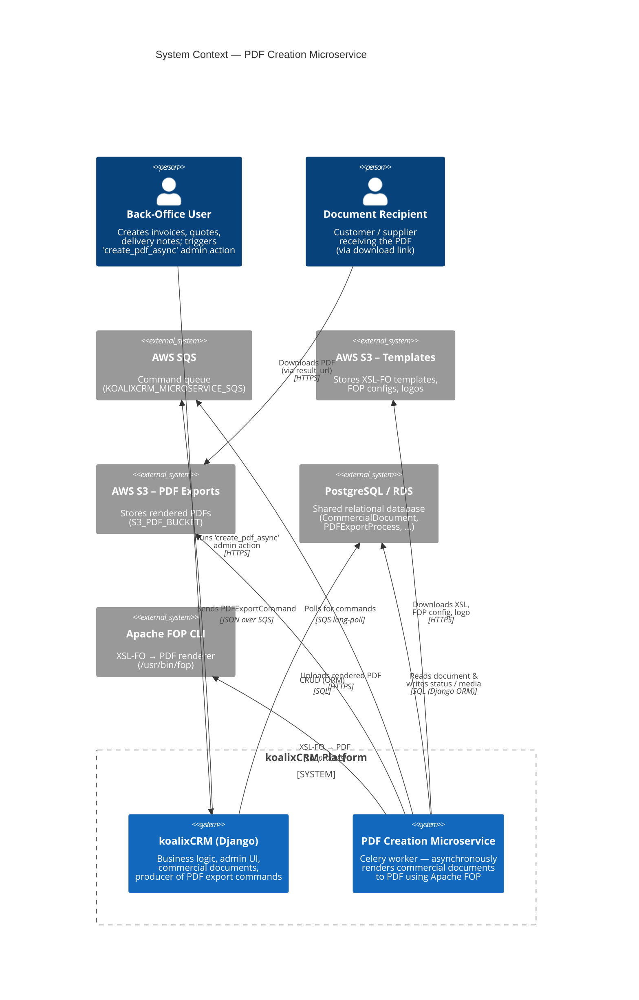

# Context Diagram

Shows the PDF Creation Microservice in the context of its users and the
surrounding systems it integrates with.

## Actors

| Actor | Role |
| --- | --- |
| **Back-Office User** | Internal user with Django admin access who selects commercial documents and triggers the `create_pdf_async` action. |
| **Document Recipient** | External customer/supplier who receives the link to the rendered PDF stored in S3. |

## External systems

| System | Purpose |
| --- | --- |
| **AWS SQS** | Decouples producer (Django) from consumer (microservice). Single queue, configured via `KOALIXCRM_MICROSERVICE_SQS`. |
| **AWS S3 (Templates)** | Holds the XSL-FO templates, FOP config, and logo files referenced by `DocumentTemplate`. Backed by Django `TemplateFileStorage`. |
| **AWS S3 (PDF Exports)** | Destination bucket for rendered PDFs. Bucket name configured via `S3_PDF_BUCKET`. |
| **PostgreSQL / RDS** | Shared database between Django and the microservice. The microservice uses the Django ORM via `django.setup()` rather than a REST API. |
| **Apache FOP CLI** | Java-based XSL-FO processor invoked as a subprocess at `/usr/bin/fop` (configurable via `FOP_EXECUTABLE`). |
