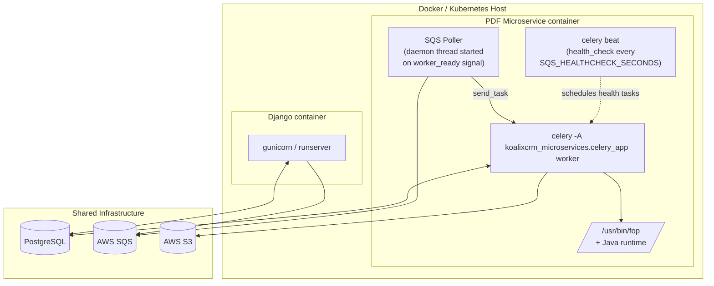

# System Architecture

Component-level view of the producer (Django) and consumer (microservice) and
how they collaborate through SQS, the shared database, S3, and Apache FOP.

```mermaid
flowchart LR
    subgraph Client["Admin Browser"]
        UI["Django Admin UI"]
    end

    subgraph DjangoApp["koalixCRM Django Application"]
        direction TB
        Admin["CommercialDocumentAdmin<br/><i>create_pdf_async action</i>"]
        Process["PDFExportProcess model<br/>(status: pending)"]
        Signal["post_save signal<br/>pdf_export_signals.py"]
        Envelope1["PDFExportCommand<br/>envelope builder"]
    end

    subgraph AWS["AWS Cloud"]
        direction TB
        SQS[("SQS Queue<br/>KOALIXCRM_MICROSERVICE_SQS")]
        S3TPL[("S3 Bucket<br/>XSL / FOP config / logos")]
        S3PDF[("S3 Bucket<br/>S3_PDF_BUCKET")]
    end

    subgraph Microservice["PDF Creation Microservice (container)"]
        direction TB
        Poller["SQS Poller thread<br/>sqs_poller.py"]
        Celery["Celery worker<br/>task: pdf_export_task.tasks.run"]
        Resolver["Source resolver<br/>MODEL_MAP"]
        Renderer["PDFExport.create_pdf"]
        FOPWrap["FOP subprocess<br/>wrapper"]
        Uploader["S3 Uploader"]
        Status["Process status updater<br/>+ CommercialDocumentMedia creator"]
    end

    FOP[/"Apache FOP CLI<br/>/usr/bin/fop"/]
    DB[("PostgreSQL<br/>(shared)")]

    UI -- "select docs +<br/>run action" --> Admin
    Admin -- "create record" --> Process
    Process -- "on save" --> Signal
    Signal --> Envelope1
    Envelope1 -- "SendMessage<br/>(JSON)" --> SQS

    SQS -- "ReceiveMessage<br/>(long poll)" --> Poller
    Poller -- "send_task" --> Celery
    Celery --> Resolver
    Resolver -- "ORM read" --> DB
    Resolver --> Renderer
    Renderer -- "download<br/>xsl/cfg/logo" --> S3TPL
    Renderer -- "subprocess" --> FOPWrap
    FOPWrap -- "fop -c cfg<br/>-xml doc.xml<br/>-xsl tpl.xsl<br/>-pdf out.pdf" --> FOP
    FOP -- "PDF file" --> FOPWrap
    FOPWrap --> Uploader
    Uploader -- "PutObject" --> S3PDF
    Uploader --> Status
    Status -- "ORM write" --> DB

    classDef aws fill:#fff5e6,stroke:#e59400
    classDef django fill:#e8f4ea,stroke:#2a7a3a
    classDef micro fill:#e8eefc,stroke:#2a4a8a
    class SQS,S3TPL,S3PDF aws
    class Admin,Process,Signal,Envelope1 django
    class Poller,Celery,Resolver,Renderer,FOPWrap,Uploader,Status micro
```

## Deployment / runtime layout

## Components

| Component | Location | Responsibility |
| --- | --- | --- |
| `CommercialDocumentAdmin.create_pdf_async` | `koalixcrm/contracts/admin/commercial_document_admin.py:231` | Django admin action — creates the `PDFExportProcess` record. |
| `PDFExportProcess` model | `koalixcrm/core/models/pdf_export_process.py` | Tracks status (`pending` → `processing` → `completed` / `failed`), holds `result_url` and `error_message`. |
| `pdf_export_signals.py` (`post_save`) | `koalixcrm/core/signals/pdf_export_signals.py:14-41` | On `PDFExportProcess` create → build `PDFExportCommand` envelope and `SendMessage` to SQS. |
| `PDFExportCommand` envelope | `koalixcrm_mq_commands/pdf_export_command.py` | Typed dataclass (`process_id`, `source_model`, `source_id`, `template_set_id`, `printed_by_user_id`) + JSON (de)serialization. |
| `CommandEnvelope` | `koalixcrm_mq_commands/envelope.py` | Generic `{type, payload}` wrapper used on the wire. |
| SQS Poller | `koalixcrm_microservices/sqs_poller.py` | Long-polls SQS, parses the envelope, dispatches to Celery via `send_task`. Runs as a daemon thread inside the Celery worker. |
| Celery app | `koalixcrm_microservices/celery_app.py` | Celery bootstrap, SQS broker transport config, imports task modules, starts the poller thread on `worker_ready`. |
| PDF export task | `koalixcrm_microservices/pdf_export_task/tasks.py` | `run(payload)` — the main entry point. Bootstraps Django ORM, executes the full pipeline, updates status. |
| `PDFExport.create_pdf` | `koalixcrm/core/documents/pdf_export.py:99-151` | Downloads template files from S3, serializes document to XML, invokes FOP subprocess. |
| `CommercialDocumentMedia` | `koalixcrm/contracts/models/commercial_document_media.py` | Persistent record of each rendered PDF (S3 URL, key, status, created_by, FK to `PDFExportProcess`). |
