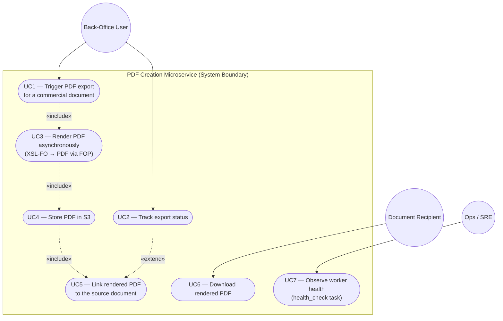
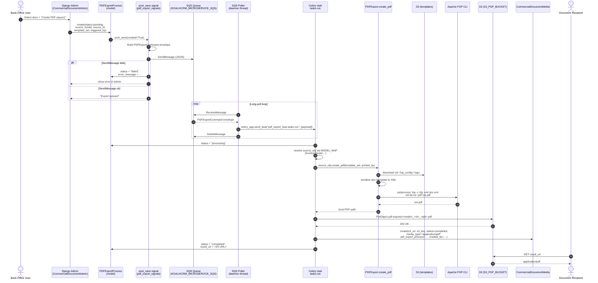
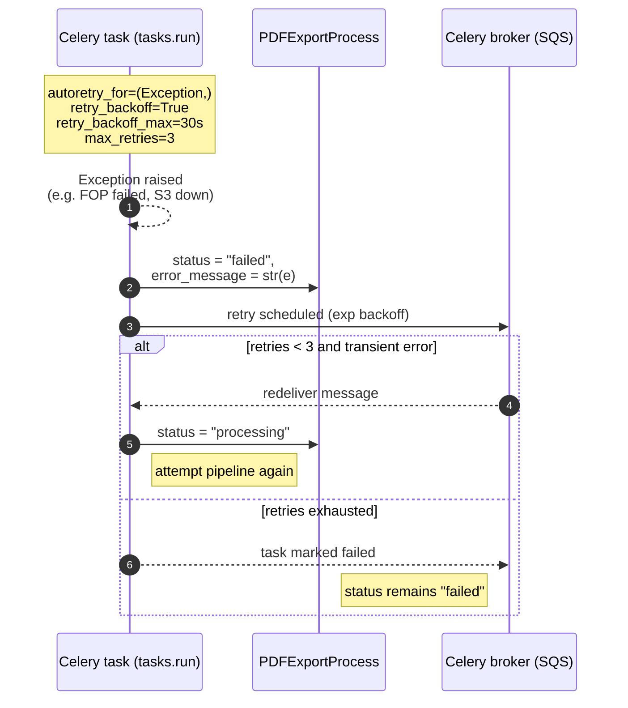

# Use Case & End-to-End Flow

## Use case diagram

### Primary use case — UC1 "Trigger PDF export"

| | |
| --- | --- |
| **Actor** | Back-Office User |
| **Precondition** | User is authenticated and has the admin permission on the target `CommercialDocument` subclass; at least one `DocumentTemplate` exists. |
| **Trigger** | User selects documents in the Django admin change-list and runs the `create_pdf_async` action. |
| **Main success scenario** | 1. A `PDFExportProcess` is created with status `pending`. 2. A `PDFExportCommand` envelope is enqueued on SQS. 3. The microservice consumes the message and renders the PDF. 4. The PDF is uploaded to S3. 5. A `CommercialDocumentMedia` entry is created and `PDFExportProcess.status = completed` with a `result_url`. |
| **Alternative flows** | *A1.* SQS `SendMessage` fails → process status is set directly to `failed` in the signal handler. *A2.* Celery task raises → autoretry up to 3 times with backoff, then `failed` with `error_message`. |
| **Postcondition** | A PDF is reachable via `result_url`, and `CommercialDocumentMedia` links it to the source document. |

## End-to-end sequence flow

### Error / retry paths

