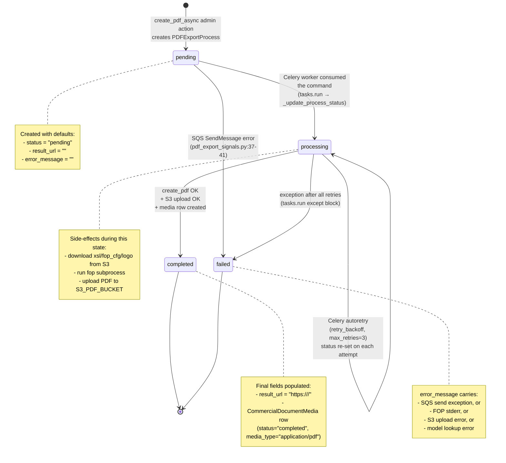

# State Machine — `PDFExportProcess`

Every PDF export run is represented by exactly one `PDFExportProcess` row
(`koalixcrm/core/models/pdf_export_process.py`). Its `status` field is the
authoritative state:

| State | Set by | Meaning |
| --- | --- | --- |
| `pending` | Django admin action (initial) | Record created, SQS message not yet confirmed sent. |
| `processing` | Celery worker (`tasks.run`, step 1) | Worker has picked up the command and started rendering. |
| `completed` | Celery worker (on success) | PDF uploaded to S3, `result_url` set, `CommercialDocumentMedia` row created. |
| `failed` | Signal (SQS enqueue error) **or** Celery worker (final failure) | Export could not be produced; `error_message` contains the reason. |

## State diagram

## Allowed transitions

| From → To | Triggered by | Code reference |
| --- | --- | --- |
| *(none)* → `pending` | Admin action creates the row | `commercial_document_admin.py:231-256` |
| `pending` → `processing` | Worker picks up SQS message | `pdf_export_task/tasks.py:99` |
| `pending` → `failed` | SQS `SendMessage` raises in signal | `pdf_export_signals.py:37-41` |
| `processing` → `completed` | `create_pdf` + S3 upload + media row all succeed | `pdf_export_task/tasks.py:132` |
| `processing` → `failed` | Exception, after Celery retries exhausted | `pdf_export_task/tasks.py:137-141` |
| `processing` → `processing` | Celery autoretry re-runs `tasks.run` | `tasks.py:76-82` (`autoretry_for`, `retry_backoff`, `max_retries=3`) |

Transitions not listed above are not expected; any other change would be a bug
or an operator-performed manual intervention in Django admin.

## Related `CommercialDocumentMedia` lifecycle

`CommercialDocumentMedia` mirrors the export status but is created **only on
success** (`tasks.py:122-130`). Its own `status` field defaults to `pending` but
the worker always inserts it with `status='completed'`. If the upstream
`PDFExportProcess` never reaches `completed`, no media row is created.
