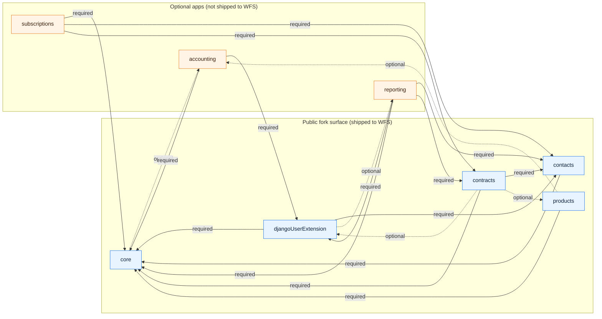

# Optional apps and peer-dependency pattern

koalixcrm is shipped as a set of Django apps. Some of them are mandatory
(`core`, `contacts`, `contracts`, `djangoUserExtension`, `products`) and form
the *fork-public* surface consumed verbatim by downstream products such as the
WFS (`qq_workflow_support_webapp_backend`). Others (`accounting`, `reporting`,
`subscriptions`) are optional — a WFS deployment does not install them.

Apps must therefore adapt to the presence or absence of sibling apps without
hard crashes, and without parallel configuration machinery. This document
describes the single pattern the codebase uses.

---

## Rule 1 — `INSTALLED_APPS` is the only source of truth

Every runtime branch that depends on "is sibling app X installed?" asks
Django directly:

```python
from django.apps import apps

if apps.is_installed('koalixcrm.products'):
    ...
```

There is **no** `KOALIXCRM_<APP>_REQUIRED` env variable, no parallel
`settings.KOALIXCRM_FEATURE_FLAGS` dict, no per-app config registry. The
`INSTALLED_APPS` list in `settings.py` is authoritative; everything else
derives from it.

Rationale: two sources of truth drift. Overrides that let a running system
claim "accounting is installed but don't enforce it" hide real state from
operators and invite surprising failure modes in production.

## Rule 2 — Hard dependencies fail at startup, not at request time

If an app truly cannot function without a peer, it declares the peer in its
`AppConfig` and registers a system check:

```python
# koalixcrm/<app>/apps.py
from django.apps import AppConfig, apps
from django.core.checks import Error, register


class ContractsConfig(AppConfig):
    name = 'koalixcrm.contracts'
    required_peers: tuple[str, ...] = ('koalixcrm.core', 'koalixcrm.contacts')
    optional_peers: tuple[str, ...] = ('koalixcrm.products', 'koalixcrm.djangoUserExtension')

    def ready(self):
        @register()
        def check_required_peers(app_configs, **kwargs):
            errors = []
            for peer in self.required_peers:
                if not apps.is_installed(peer):
                    errors.append(Error(
                        f"'{self.name}' requires '{peer}' in INSTALLED_APPS.",
                        hint=f"Add '{peer}' to INSTALLED_APPS or remove '{self.name}'.",
                        id=f'{self.label}.E001',
                    ))
            return errors
```

`manage.py runserver`, `manage.py migrate`, and the production WSGI entry
point all invoke `django.core.checks.run_checks()`. If any `Error` comes back,
startup aborts with a clear message naming the missing peer. This prevents the
"module looks loaded, crashes on first request" failure mode.

`optional_peers` is informational — listed for documentation, but not checked.

## Rule 3 — Optional peers adapt silently

When a peer is optional, the host app branches on `apps.is_installed` and
degrades gracefully:

- Admin inlines hide fields backed by the missing peer.
- Serializers drop nested sections.
- Business logic falls back to data stored on the host row (e.g. line-item
  price and tax rate when `products` is absent).

No warning, no error, just different behaviour. Users of a WFS deployment
never see a product-type dropdown on an invoice line because that dropdown
literally isn't rendered.

## Rule 4 — Lazy imports across optional boundaries

When an app references models or serializers from an optional peer, it must
not hard-import at module load. Use `apps.get_model('<label>', '<Model>')`
inside the method that needs it, or put the `from koalixcrm.<peer>...`
statement inside the function body.

```python
def render_accounting_panel(self):
    if not apps.is_installed('koalixcrm.accounting'):
        return ''
    from koalixcrm.accounting.serializers.account_serializer import (
        OptionAccountJSONSerializer,
    )
    ...
```

The CR-5 fork-isolation test (`tests/unit/test_fork_isolation.py`) enforces
this: no top-level `import` from a forbidden app in any of the five public
apps.

---

## Current app dependency matrix

Rows are *hosts*, columns are *peers*. `R` = required peer (startup check),
`O` = optional peer (runtime branch), `—` = no relationship.

| Host \ Peer          | core | contacts | contracts | djUserExt | products | accounting | reporting | subscriptions |
|----------------------|:---:|:---:|:---:|:---:|:---:|:---:|:---:|:---:|
| core                 | —   | —   | —   | —   | —   | —   | —   | —   |
| contacts             | R   | —   | —   | —   | —   | —   | —   | —   |
| contracts            | R   | R   | —   | O   | O   | —   | —   | —   |
| djangoUserExtension  | R   | R   | —   | —   | —   | —   | O   | —   |
| products             | R   | —   | —   | —   | —   | O   | —   | —   |
| accounting           | R   | —   | —   | R   | —   | —   | —   | —   |
| reporting            | R   | R   | R   | R   | —   | —   | —   | —   |
| subscriptions        | R   | R   | R   | —   | —   | —   | —   | —   |

**Notes on the optional (`O`) edges:**

- `contracts → products` (CR-2): `CommercialDocumentPosition.product_type` is
  nullable; when `products` is absent, positions carry their own
  `position_price_per_unit` and `position_tax_rate`, and the admin inline
  hides the product/tax selectors.
- `contracts → djangoUserExtension`: PDF template resolution. When absent,
  PDF export is disabled (no template set to dispatch).
- `products → accounting`: `ProductType.accounting_product_category` is a
  nullable FK; when `accounting` is absent, the admin hides it and the
  serializer omits the nested category block.
- `djangoUserExtension → reporting`: `UserExtension.create_work_report`
  integration; absent peer hides the admin action.
- `core → accounting`: `Tax.account_activa` / `account_passiva` are nullable
  FKs; `Tax.clean()` enforces not-null only when `accounting` is installed.

## Component diagram



Solid arrows are `required_peers` (startup check fires). Dotted arrows are
`optional_peers` (runtime `apps.is_installed` branch).

## Migrating existing code to the pattern

When removing a hard import from an optional peer:

1. Replace the module-level `from koalixcrm.<peer>...` with
   `apps.get_model(...)` inside the method, or a local import inside the
   function that uses it.
2. Wrap the call site in `if apps.is_installed('koalixcrm.<peer>'):` when the
   feature should silently degrade, or let the startup check enforce the
   presence of a hard peer.
3. Confirm `tests/unit/test_fork_isolation.py` still passes — this is the
   invariant that catches regressions.
4. If you add a new `optional_peers` entry, document the degraded behaviour
   in the table above.

---

## See also

- `tests/unit/test_fork_isolation.py` — enforces no top-level imports of
  `accounting`, `reporting`, `subscriptions` from the five public apps.
- `change_requests/CR_001_WFS_INTEGRATION.md` — the CR that established the
  fork-public surface (CR-5, CR-7).
- Django docs: [System check framework](https://docs.djangoproject.com/en/stable/topics/checks/).
