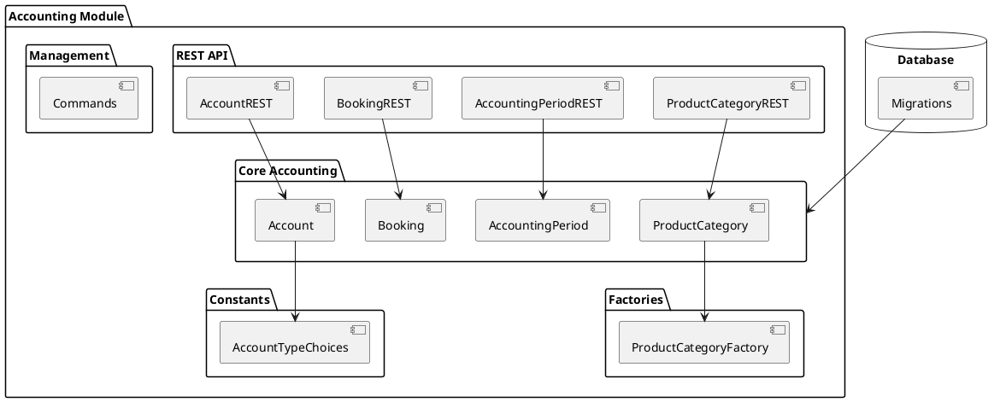
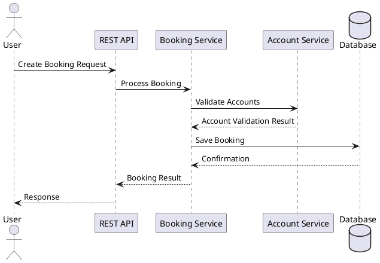
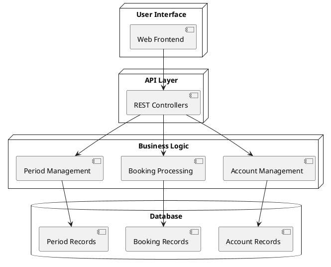
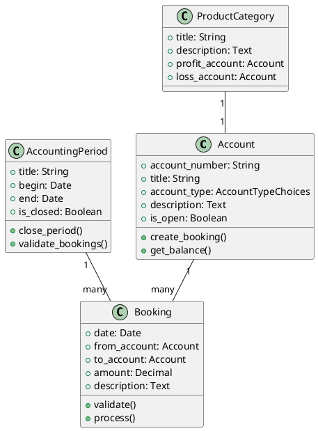

# KoalixCRM Accounting Module

## 3.2.1 Introduction

### Purpose of the Package
The accounting module is a core component of KoalixCRM that provides comprehensive accounting functionality for business operations. It handles financial transactions, account management, booking operations, and financial period tracking within the CRM system.

### Contents Overview
The module consists of several key components:
- Core Accounting Logic (`accounting/`)
- Constants and Choices (`const/`)
- Data Factories (`factories/`)
- Internationalization (`locale/`)
- Management Commands (`management/`)
- Database Migrations (`migrations/`)
- REST API Interface (`rest/`)
- Static Resources (`static/`)
- Unit Tests (`tests/`)

## 3.2.2 Package Diagram



## 3.2.3 Interaction Diagrams

### Booking Process Sequence


### Data Flow Diagram


## 3.2.4 Class Diagrams per Package

### Core Accounting Classes


## 3.2.5 Design Patterns Used

### Pattern Descriptions
1. **Model-View-Controller (MVC)**
   - Implementation: Django's MTV architecture
   - Models: Account, Booking, AccountingPeriod classes
   - Views: REST API controllers
   - Templates: Static templates for reporting

2. **Factory Pattern**
   - Used in ProductCategory creation
   - Facilitates testing and standard category creation
   - Implemented in factories/factory_product_category.py

3. **Repository Pattern**
   - Implemented through Django's ORM
   - Abstracts data persistence operations
   - Enables clean separation of business logic from data access

### Implementation Details
The module implements these patterns through:
- Clear separation of concerns (models.py, views.py, rest/)
- Standardized data access through Django's ORM
- Factory classes for object creation
- REST API for clean interface separation

### Technical Specifications

#### Configuration Options
- Account number format customization
- Accounting period settings
- Booking validation rules
#### Security Considerations
1. Authentication required for all accounting operations
2. Role-based access control for different accounting functions
3. Transaction logging and audit trails
4. Data validation at multiple levels

#### Performance Guidelines
1. Bulk operations for large datasets
2. Indexed fields for frequent queries
3. Caching strategies for account balances
4. Optimized database queries

#### Extension Points
1. Custom booking validators
2. Account type plugins
3. Report generators
4. API extensions

## Integration Points

### External Systems
- REST API endpoints for third-party integration
- Import/Export capabilities for accounting data
- Authentication system integration
- Reporting system integration

### Internal Dependencies
- Django ORM for data persistence
- Django REST framework for API
- Internationalization framework
- Template system for reporting

## Error Handling

### Common Scenarios
1. Invalid booking attempts
2. Period closure conflicts
3. Account balance validation
4. Data consistency checks

### Recovery Procedures
1. Transaction rollback mechanisms
2. Automated error logging
3. User notification systems
4. Data reconciliation tools

## Maintenance and Operations

### Regular Tasks
1. Period closing procedures
2. Balance verification
3. Data backup requirements
4. Performance monitoring

### Troubleshooting
1. Logging system usage
2. Debug mode capabilities
3. Testing procedures
4. Common issue resolutions

## API Reference

### REST Endpoints
```
GET    /api/accounting/accounts/
POST   /api/accounting/accounts/
GET    /api/accounting/accounts/{id}/
PUT    /api/accounting/accounts/{id}/
DELETE /api/accounting/accounts/{id}/

GET    /api/accounting/bookings/
POST   /api/accounting/bookings/
GET    /api/accounting/bookings/{id}/
PUT    /api/accounting/bookings/{id}/
DELETE /api/accounting/bookings/{id}/

GET    /api/accounting/periods/
POST   /api/accounting/periods/
GET    /api/accounting/periods/{id}/
PUT    /api/accounting/periods/{id}/
DELETE /api/accounting/periods/{id}/
```

### Management Commands
```bash
# Period management
python manage.py close_accounting_period --period-id=<id>
python manage.py validate_bookings --period-id=<id>

# Data management
python manage.py export_accounting_data --format=<format>
python manage.py import_accounting_data --file=<file>
```

## Testing Strategy

### Unit Tests
- Account creation and validation
- Booking operations
- Period management
- API endpoint testing

### Integration Tests
- End-to-end booking processes
- Period closure workflows
- Data import/export operations
- API integration scenarios

## Deployment Considerations

### Requirements
- Django 2.0+
- Python 3.6+
- PostgreSQL recommended for production
- Redis for caching (optional)

### Configuration
- Database settings
- Cache configuration
- API authentication
- Logging setup

### Monitoring
- Transaction volume metrics
- Error rate tracking
- Performance monitoring
- Database query analysis

## Contributing Guidelines

### Development Setup
1. Clone the repository
2. Install dependencies
3. Configure development environment
4. Run tests

### Code Standards
- PEP 8 compliance
- Documentation requirements
- Test coverage expectations
- Code review process

## Support and Resources

### Documentation
- API documentation
- User guides
- Developer guides
- Troubleshooting guides

### Community
- Issue tracking
- Feature requests
- Discussion forums
- Contributing guidelines

### Contact
For technical support and queries:
- GitHub Issues
- Developer mailing list
- Technical documentation
- Community forums
