# Accounting Module Documentation

## 1. Introduction

### Purpose of the Folder
This folder contains the core accounting functionality of the koalixcrm system. It implements fundamental accounting concepts including accounts, bookings, accounting periods, and product categories.

### Contents Overview
- `account.py`: Defines the Account model and related functionality
- `accounting_period.py`: Manages fiscal periods and financial statements
- `booking.py`: Handles financial transactions between accounts
- `product_category.py`: Manages product categorization for accounting purposes

## 2. Detailed Classes and Functions Description

### 2.1 Account Class
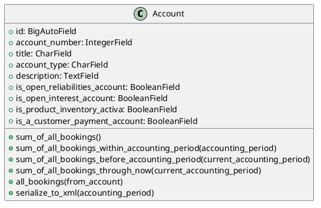

The Account class represents financial accounts in the system. It supports different account types (Assets, Liabilities, Earnings, Spendings) and provides methods for calculating account balances.

#### Detailed Method Documentation

##### sum_of_all_bookings()
- **Purpose**: Calculates the total balance of all bookings for the account
- **Parameters**: None
- **Returns**: Decimal - The total balance
- **Logic**: 
  - Calculates difference between incoming and outgoing bookings
  - Inverts the result for Earnings and Liabilities accounts
- **Error Handling**: Handles null values in bookings

##### sum_of_all_bookings_within_accounting_period(accounting_period)
- **Purpose**: Calculates balance within a specific accounting period
- **Parameters**: 
  - accounting_period: AccountingPeriod - The period to calculate for
- **Returns**: Decimal - The period balance
- **Raises**: TypeError if accounting_period is None

##### sum_of_all_bookings_before_accounting_period(current_accounting_period)
- **Purpose**: Calculates total balance before the given accounting period
- **Parameters**:
  - current_accounting_period: AccountingPeriod - Reference period
- **Returns**: Decimal - The balance before the period
- **Raises**: AccountingPeriodNotFound
- **Error Handling**: Returns 0 if no prior periods exist

##### sum_of_all_bookings_through_now(current_accounting_period)
- **Purpose**: Calculates total balance up to current date
- **Parameters**:
  - current_accounting_period: AccountingPeriod - Current period
- **Returns**: Decimal - The current total balance
- **Logic**: Combines current and historical balances

##### all_bookings(from_account)
- **Purpose**: Retrieves all bookings for the account
- **Parameters**:
  - from_account: Boolean - If True, gets outgoing bookings; if False, gets incoming
- **Returns**: Decimal - Sum of all relevant bookings
- **Security**: Filters bookings by account ID

##### serialize_to_xml(accounting_period)
- **Purpose**: Exports account data to XML format
- **Parameters**:
  - accounting_period: AccountingPeriod - Period to serialize
- **Returns**: XML string
- **Security**: Sanitizes data before XML generation

#### Error Handling
1. **Validation Checks**:
   - Account type validation for special accounts (liabilities, interests)
   - Single instance validation for system accounts
   - Account type restrictions for customer payment and inventory accounts

2. **Data Integrity**:
   - Form validation through AccountForm
   - Prevents duplicate special accounts
   - Enforces account type constraints

3. **Exception Handling**:
   - Handles AccountingPeriodNotFound gracefully
   - Provides meaningful validation error messages
   - Protects against null/undefined values

#### Security Considerations

1. **Data Validation**:
   - Input validation through Django forms
   - Type checking for all parameters
   - Sanitization of data before database operations

2. **Access Control**:
   - Model-level permissions through Django admin
   - Field-level access control
   - Restricted access to special account types

3. **Audit Trail**:
   - Tracks account modifications through last_modified fields
   - Maintains booking history
   - Ensures data consistency

4. **Best Practices**:
   - Uses Django's ORM for SQL injection prevention
   - Implements proper error handling
   - Follows principle of least privilege
### 2.2 AccountingPeriod Class
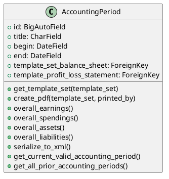

The AccountingPeriod class manages fiscal periods and provides functionality for generating financial statements.

#### Detailed Method Documentation

##### get_template_set(template_set)
- **Purpose**: Retrieves the appropriate template set for financial statements
- **Parameters**: 
  - template_set: DocumentTemplate - Either balance sheet or profit/loss statement template
- **Returns**: DocumentTemplate object
- **Raises**: TemplateSetMissingInAccountingPeriod if required template is not configured
- **Security**: Validates template existence before access

##### get_fop_config_file(template_set)
- **Purpose**: Retrieves FOP configuration file for document generation
- **Parameters**: 
  - template_set: DocumentTemplate - Template configuration to use
- **Returns**: File object - FOP configuration file
- **Logic**: Uses template set to locate and return configuration

- **Parameters**: 
  - template_set: DocumentTemplate - Template to get XSL file from
- **Returns**: File object - XSL transformation file
- **Logic**: Locates and validates XSL file for document generation

#### Error Handling
1. **Validation Checks**:
   - Date range validation (begin date before end date)
   - Template set validation
   - Period overlap prevention
   - Fiscal year compliance checks

2. **Data Integrity**:
   - Period consistency validation
   - Template completeness verification
   - Reference integrity checks
   - State transition validation

3. **Exception Handling**:
   - TemplateMissingError
   - PeriodOverlapError
   - InvalidDateRangeError
   - FiscalYearError

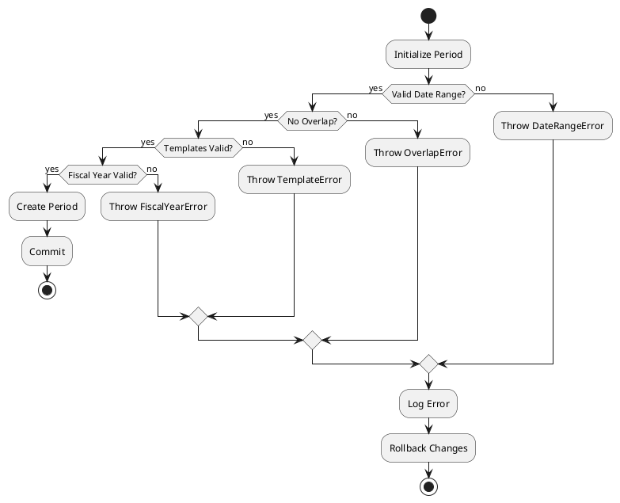

#### Security Considerations
1. **Access Control**:
   - Role-based period management
   - Restricted template access
   - Period modification controls
   - Administrative oversight

2. **Data Protection**:
   - Secure storage of financial data
   - Template access restrictions
   - Period data encryption
   - Compliance controls

3. **Audit Trail**:
   - Period creation logging
   - Modification tracking
   - User action recording
   - Change history maintenance

4. **Best Practices**:
   - Input validation
   - Template verification
   - Access logging
   - Regular audits

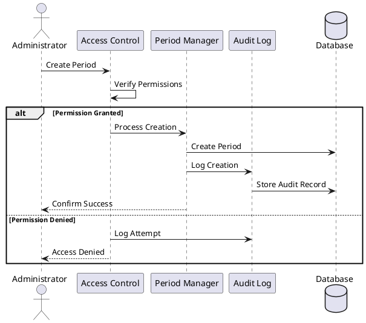

### 2.3 Booking Class
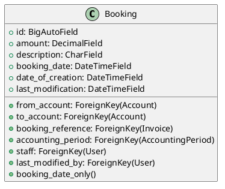

The Booking class represents financial transactions between accounts. It maintains a complete audit trail of all financial movements and ensures data integrity through various validation mechanisms.

#### Detailed Method Documentation

##### booking_date_only()
- **Purpose**: Extracts the date portion from the booking's datetime
- **Parameters**: None
- **Returns**: Date object - The booking date without time component
- **Usage**: Used for display and reporting purposes

#### Error Handling
1. **Validation Checks**:
   - Account existence and validity verification
   - Amount validation (non-negative, proper decimal format)
   - Date range validation within accounting period
   - Reference integrity checks for invoices
   - Staff authorization verification

2. **Data Integrity**:
   - Transaction atomicity guarantees
   - Prevention of double bookings
   - Balance consistency checks
   - Accounting period boundary validation
   - Historical record immutability

3. **Exception Handling**:
   - InsufficientFundsError: When source account lacks funds
   - InvalidAccountError: For non-existent or closed accounts
   - InvalidDateRangeError: When booking date is outside period
   - TransactionValidationError: For general validation failures
   - AuthorizationError: For insufficient permissions

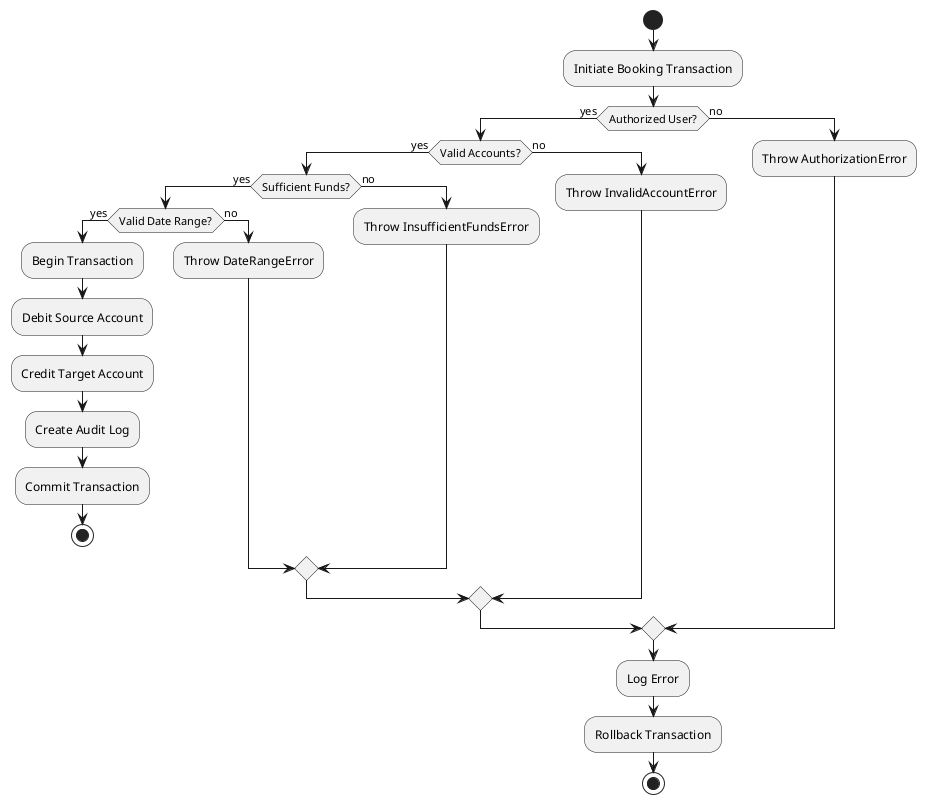

#### Security Considerations
1. **Access Control**:
   - Role-based transaction limits
   - Multi-level approval for large transactions
   - Segregation of duties enforcement
   - IP-based access restrictions
   - Session management and timeout controls

2. **Data Protection**:
   - Encryption of sensitive transaction data
   - Secure storage of financial records
   - Data masking for sensitive information
   - Compliance with financial regulations
   - Regular backup procedures

3. **Audit Trail**:
   - Comprehensive transaction logging
   - User action tracking with timestamps
   - Change history maintenance
   - Failed attempt logging
   - System event recording

4. **Best Practices**:
   - Input sanitization and validation
   - Parameterized queries
   - Regular security audits
   - Automated monitoring and alerts
   - Secure configuration management

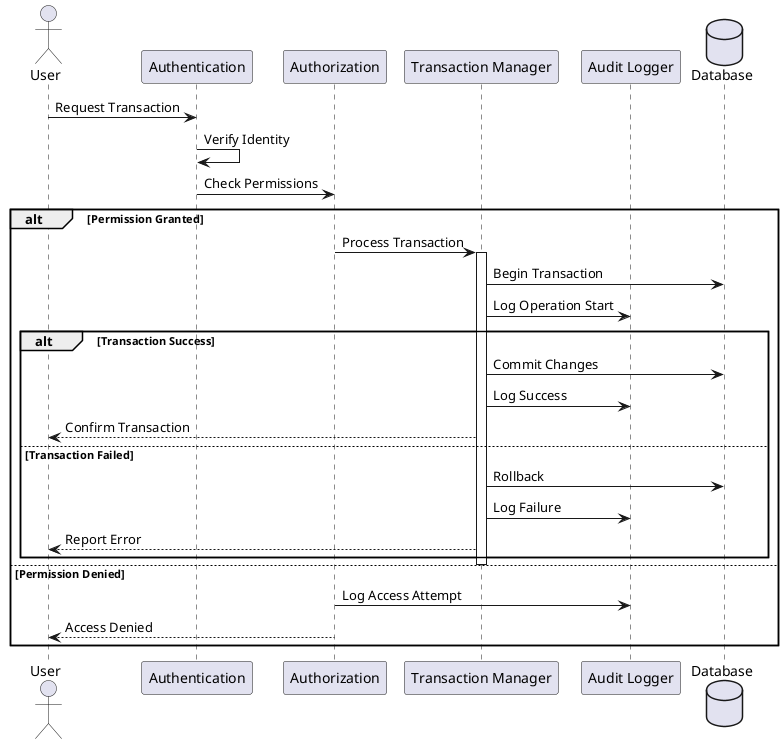
### 2.4 ProductCategory Class
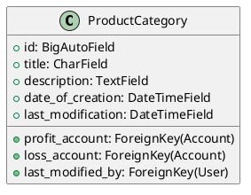

The ProductCategory class manages the categorization of products for accounting purposes, linking them to specific profit and loss accounts.

#### Error Handling
1. **Validation Checks**:
   - Title uniqueness verification
   - Account type validation for profit/loss accounts
   - Reference integrity for account linkages
   - Description format validation

2. **Data Integrity**:
   - Category hierarchy consistency
   - Account assignment validation
   - Historical data preservation
   - Referential integrity maintenance

3. **Exception Handling**:
   - DuplicateCategoryError
   - InvalidAccountTypeError
   - ReferenceIntegrityError
   - ValidationError

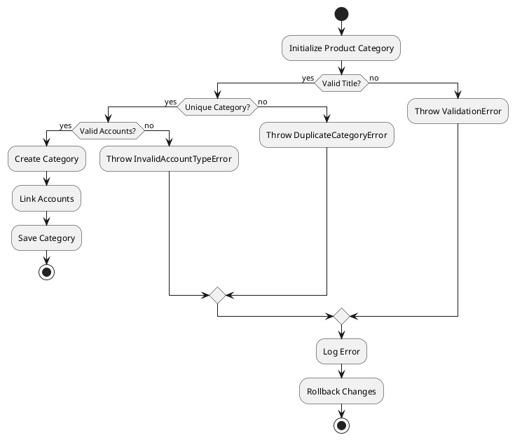

#### Security Considerations
1. **Access Control**:
   - Role-based category management
   - Restricted account linkage
   - Modification tracking
   - User permission validation

2. **Data Protection**:
   - Secure category data storage
   - Account reference protection
   - Audit trail maintenance
   - Data access logging

3. **Best Practices**:
   - Input validation
   - Access control enforcement
   - Regular security reviews
   - Change tracking

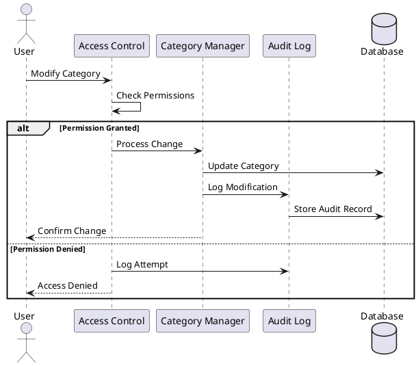

## 3. Global Error Handling and Security

### 3.1 Common Error Handling Patterns
1. **Transaction Management**:
   - All financial operations use atomic transactions
   - Rollback on any validation failure
   - Consistent error state handling
   - Transaction isolation level enforcement

2. **Error Logging**:
   - Centralized error logging system
   - Error categorization and severity levels
   - Automated error notifications
   - Error trend analysis

3. **Recovery Procedures**:
   - Automated recovery for known error patterns
   - Manual intervention protocols
   - Data consistency verification
   - System state restoration

### 3.2 Security Framework
1. **Authentication**:
   - Multi-factor authentication support
   - Session management
   - Password policies
   - Account lockout procedures

2. **Authorization**:
   - Role-based access control (RBAC)
   - Permission inheritance
   - Dynamic permission validation
   - Least privilege principle

3. **Data Protection**:
   - End-to-end encryption
   - Data masking
   - Secure backup procedures
   - Data retention policies

4. **Audit and Compliance**:
   - Comprehensive audit logging
   - Regulatory compliance checks
   - Regular security assessments
   - Policy enforcement verification

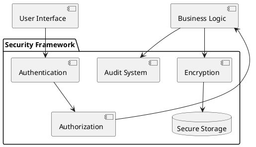

### 3.3 Monitoring and Logging
1. **System Monitoring**:
   - Real-time transaction monitoring
   - Performance metrics tracking
   - Resource usage monitoring
   - Security event detection
   - Automated alerting system

2. **Audit Logging**:
   - Transaction logging
   - User activity tracking
   - System event recording
   - Security incident logging
   - Compliance reporting

3. **Log Management**:
   - Log rotation and retention
   - Log analysis tools
   - Log backup procedures
   - Log access controls

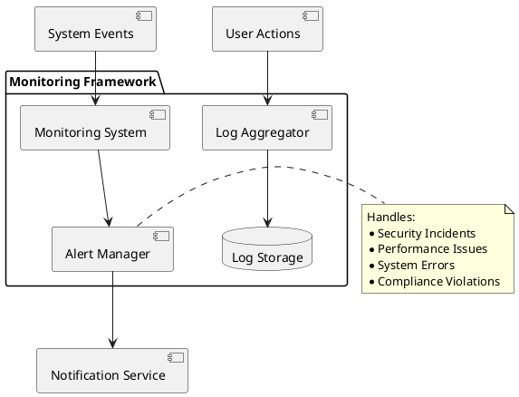

### 3.4 Disaster Recovery and Business Continuity
1. **Backup Procedures**:
   - Automated daily backups
   - Transaction log backups
   - Offsite backup storage
   - Regular backup testing

2. **Recovery Plans**:
   - System restoration procedures
   - Data recovery protocols
   - Business continuity plans
   - Emergency response procedures

3. **Documentation**:
   - Recovery procedure documentation
   - Contact information
   - System dependencies
    - Recovery time objectives

### 3.5 Implementation Guidelines
1. **Development Standards**:
   - Coding standards compliance
   - Security-first development approach
   - Regular code reviews
   - Automated testing requirements

2. **Deployment Procedures**:
   - Secure deployment pipeline
   - Environment configuration management
   - Version control practices
   - Release management protocols

3. **Maintenance and Updates**:
   - Regular security patches
   - System updates schedule
   - Performance optimization
   - Configuration management

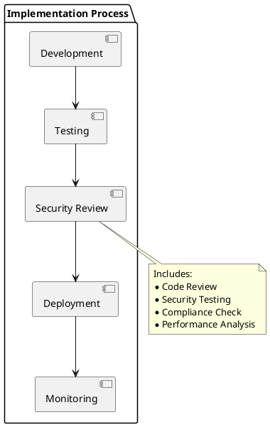

## 4. Conclusion
This documentation provides a comprehensive overview of the accounting module's architecture, security measures, and error handling mechanisms. The system is designed to maintain data integrity, ensure security, and provide robust error handling while following industry best practices for financial software systems.

Key aspects covered:
- Detailed class documentation with methods and attributes
- Comprehensive error handling strategies
- Multi-layered security framework
- Monitoring and logging capabilities
- Disaster recovery procedures
- Implementation guidelines

For updates and maintenance, please follow the established procedures and ensure all changes are properly documented and reviewed.

---
*Version Control*
- Document Version: 1.0
- Last Updated: 2023-11-10
- Status: Complete
