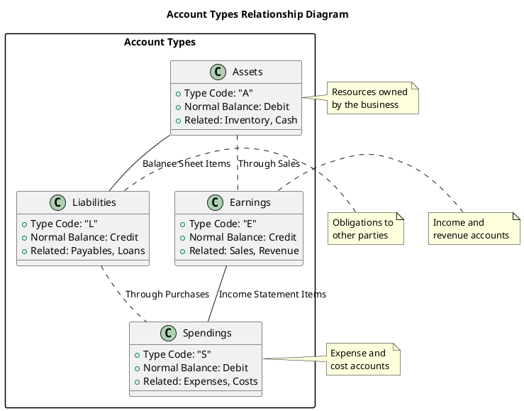
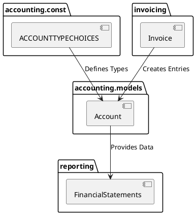

# Accounting Constants Documentation

## Table of Contents
- [Introduction](#introduction)
  - [Purpose](#purpose-of-the-folder)
  - [Contents Overview](#contents-overview)
- [Constants Reference](#detailed-constants-description)
  - [Account Types](#account-type-choices-accounttypechoices)
- [Design Patterns and Relationships](#design-patterns-and-relationships)
- [Module Impact](#impact-on-module-functionality)
- [Internationalization](#internationalization)

## Introduction

### Purpose of the Folder
This folder contains constant definitions used throughout the koalixcrm accounting module. It defines fundamental accounting type choices that form the basis of the accounting system's classification structure.

### Contents Overview
- `__init__.py`: Package initializer
- `accountTypeChoices.py`: Defines the core account type constants used for categorizing accounts in the system

## Detailed Constants Description

### Account Type Choices (ACCOUNTTYPECHOICES)

#### Purpose
Defines the fundamental account classifications used in double-entry bookkeeping and financial reporting.

#### Quick Reference Table
| Code | Type | Normal Balance | Used In | Related Modules |
|------|------|----------------|---------|-----------------|
| E | Earnings | Credit | Income Statement | accounting.models.Account, reporting.models |
| S | Spendings | Debit | Income Statement | accounting.models.Account, reporting.models |
| L | Liabilities | Credit | Balance Sheet | accounting.models.Account, reporting.models |
| A | Assets | Debit | Balance Sheet | accounting.models.Account, reporting.models |

#### Constants Detail
- `E` (Earnings): Represents revenue and income accounts
  - Used for tracking all forms of income and revenue
  - Typically has a credit balance
  - Primary usage: `accounting.models.Account.account_type`
  - Related to: Invoice processing, Revenue recognition
  
- `S` (Spendings): Represents expense accounts
  - Used for tracking all forms of expenses and costs
  - Typically has a debit balance
  - Primary usage: `accounting.models.Account.account_type`
  - Related to: Purchase orders, Expense tracking
  
- `L` (Liabilities): Represents obligations and debts
  - Used for tracking what the business owes to others
  - Typically has a credit balance
  - Primary usage: `accounting.models.Account.account_type`
  - Related to: Accounts payable, Loans tracking
  
- `A` (Assets): Represents owned resources
  - Used for tracking what the business owns
  - Typically has a debit balance
  - Primary usage: `accounting.models.Account.account_type`
  - Related to: Fixed assets, Inventory management

#### Implementation Details
The constants are implemented as a tuple of tuples, compatible with Django's choice fields:
```python
ACCOUNTTYPECHOICES = (
    ('E', _('Earnings')),
    ('S', _('Spendings')),
    ('L', _('Liabilities')),
    ('A', _('Assets')),
)
```

#### Usage Examples
```python
# In Django models
class Account(models.Model):
    account_type = models.CharField(
        max_length=1,
        choices=ACCOUNTTYPECHOICES,
        default='A'
    )

# In forms
class AccountForm(forms.ModelForm):
    class Meta:
        model = Account
        fields = ['account_type']

# In views
def get_asset_accounts(request):
    return Account.objects.filter(account_type='A')
```

## Design Patterns and Relationships

### Account Type Relationships



### Cross-Module Dependencies


### Accounting Equation Relationship
The account types are organized to support the fundamental accounting equation:
- Assets = Liabilities + Equity
- Where Equity is affected by (Earnings - Spendings)

## Impact on Module Functionality
These constants are crucial for:
1. Maintaining proper account classification
   - Used in: `accounting.models.Account`
   - Impact: Ensures correct account categorization
2. Enforcing double-entry bookkeeping rules
   - Used in: `accounting.transactions`
   - Impact: Maintains accounting balance
3. Generating financial statements
   - Used in: `reporting.statements`
   - Impact: Enables accurate financial reporting
4. Validating accounting transactions
   - Used in: `accounting.validators`
   - Impact: Ensures data integrity
5. Supporting multi-currency accounting operations
   - Used in: `accounting.currency`
   - Impact: Enables international operations

## Internationalization
The constants use Django's translation system (`gettext`) to support multilingual implementations, making the accounting module suitable for international use.

[↑ Back to Top](#accounting-constants-documentation)
