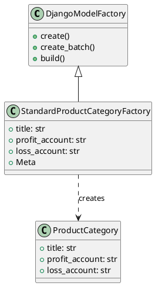
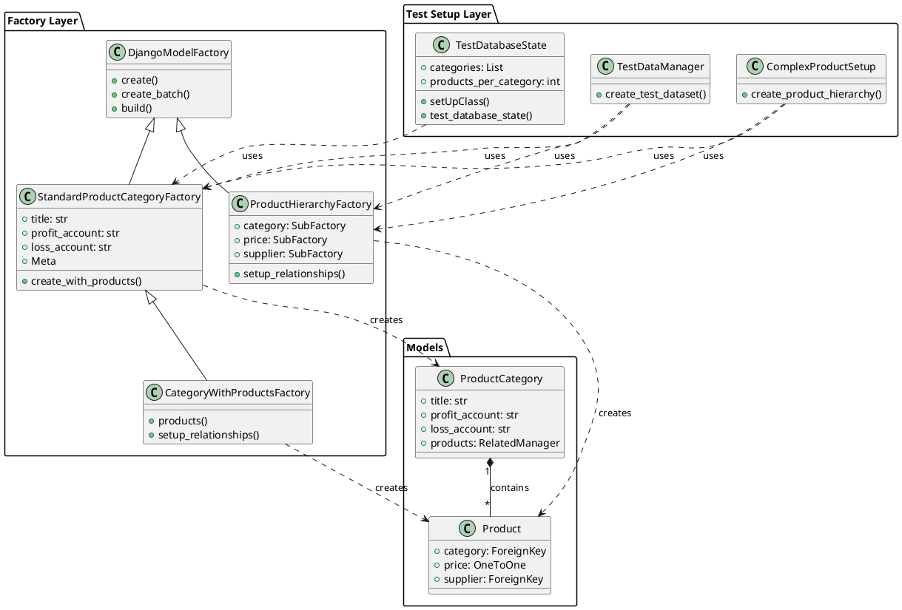

# Accounting Factories Documentation

## Introduction

### Purpose of the Folder
This folder contains factory classes used for testing the accounting module of koalixcrm. These factories facilitate the creation of test data using the Factory Boy pattern, making it easier to set up test scenarios with consistent and customizable test data.

### Contents Overview
- `__init__.py`: Package initialization file
- `factory_product_category.py`: Contains factory for creating ProductCategory instances for testing

## Detailed Classes and Functions Description

### StandardProductCategoryFactory

#### Purpose
The StandardProductCategoryFactory is designed to create test instances of ProductCategory models with predefined default values. This factory simplifies the process of creating product categories during testing.

#### Class Details
```python
class StandardProductCategoryFactory(factory.django.DjangoModelFactory):
    class Meta:
        model = ProductCategory
        django_get_or_create = ('title',)

    title = "Service"
    profit_account = ""
    loss_account = ""
```

#### Attributes
- `title` (str): Default value is "Service"
- `profit_account` (str): Default value is empty string
- `loss_account` (str): Default value is empty string

#### Meta Configuration
- `model`: Points to the ProductCategory model
- `django_get_or_create`: Uses ('title',) as the unique identifier for get_or_create operations

## Design Patterns Used

### Factory Pattern Implementation
The factories in this folder implement the Factory Boy pattern, which is an implementation of the Factory Pattern specifically designed for testing Django models. This pattern provides several benefits:

1. **Consistent Test Data**: Ensures consistent creation of test objects
2. **Reduced Test Setup Code**: Minimizes boilerplate code in tests
3. **Flexible Instance Creation**: Allows easy customization of created instances

## Usage Examples

### Basic Usage
```python
# Create a product category with default values
category = StandardProductCategoryFactory()

# Create a product category with custom title
category = StandardProductCategoryFactory(title="Custom Category")

# Create multiple categories
categories = StandardProductCategoryFactory.create_batch(size=3)
```

### Advanced Usage
```python
# Create a category with all custom values
category = StandardProductCategoryFactory(
    title="Custom Category",
    profit_account="profit-123",
    loss_account="loss-456"
)
```

## Class Diagrams

### Factory Class Structure


## Best Practices for Using Factories

1. **Default Values**
   - Use meaningful default values that represent common scenarios
   - Keep default values simple and generic

2. **Customization**
   - Override factory attributes only when necessary for specific test cases
   - Use factory traits for common variations

3. **Test Independence**
   - Create fresh instances for each test
   - Avoid sharing factory instances between tests

4. **Factory Organization**
   - Keep factories close to their corresponding models
   - Use clear naming conventions for factories

## Testing Guidelines

1. **Setup**
   - Import factories at the test module level
   - Use factories in setUp methods for common test data

2. **Test Cases**
   - Create specific instances for each test case
   - Clean up test data after tests if necessary

3. **Performance**
   - Use `build()` instead of `create()` when database persistence isn't needed
   - Use `batch_create()` for creating multiple instances efficiently

## Relationships with Models

The factories in this folder correspond directly to models in the accounting module:

- `StandardProductCategoryFactory` → `ProductCategory` model
  - Creates test instances of product categories
  - Maintains the same field structure as the model
  - Provides default values for required fields

## Troubleshooting

Common issues and solutions:

1. **Unique Constraint Violations**
   - Use unique sequences for fields that require uniqueness
   - Utilize the `django_get_or_create` option appropriately

2. **Missing Required Fields**
   - Ensure all required model fields have default values in the factory
   - Override defaults when specific values are needed

    - Create required related objects first
    - Use SubFactories for related models when necessary

## Integration Examples

### Unit Testing Scenarios
```python
# Test category creation and validation
def test_product_category_creation():
    category = StandardProductCategoryFactory()
    assert category.title == "Service"
    assert isinstance(category, ProductCategory)

# Test custom category attributes
def test_custom_category_attributes():
    category = StandardProductCategoryFactory(
        title="Custom",
        profit_account="PROFIT-001",
        loss_account="LOSS-001"
    )
    assert category.title == "Custom"
    assert category.profit_account == "PROFIT-001"
```

### Integration Testing Examples
```python
# Test category with related products
class TestProductCategoryIntegration:
    def setUp(self):
        self.category = StandardProductCategoryFactory()
        self.products = ProductFactory.create_batch(
            size=3, 
            category=self.category
        )

    def test_category_products_relationship(self):
        assert len(self.category.products.all()) == 3
        assert all(p.category == self.category for p in self.products)
```

### End-to-End Testing Cases
```python
# E2E test for category management
def test_category_lifecycle():
    # Create initial category
    category = StandardProductCategoryFactory()
    
    # Add products to category
    products = ProductFactory.create_batch(size=2, category=category)
    
    # Update category
    category.title = "Updated Category"
    category.save()
    
    # Verify relationships maintained
    assert all(p.category.title == "Updated Category" for p in products)
```

### API Testing Examples
```python
# API test using factory-created data
class TestCategoryAPI:
    def test_category_list_api(self, client):
        categories = StandardProductCategoryFactory.create_batch(size=3)
        response = client.get('/api/categories/')
        assert response.status_code == 200
        assert len(response.json()) == 3

    def test_category_detail_api(self, client):
        category = StandardProductCategoryFactory()
        response = client.get(f'/api/categories/{category.id}/')
        assert response.status_code == 200
        assert response.json()['title'] == category.title
```

### Performance Testing Setups
```python
# Performance test setup
def test_category_query_performance():
    # Create bulk test data
    categories = StandardProductCategoryFactory.create_batch(size=100)
    
    # Measure query performance
    with django.test.utils.CaptureQueriesContext(connection) as context:
        list(ProductCategory.objects.all())
        assert len(context.captured_queries) == 1
```

## Factory Integration Patterns

### Factory Combinations
```python
# Combining multiple factories
class ComplexProductSetup:
    def create_product_hierarchy(self):
        category = StandardProductCategoryFactory()
        supplier = SupplierFactory()
        return ProductFactory(
            category=category,
            supplier=supplier,
            price=PriceFactory()
        )
```

### Complex Object Creation
```python
# Creating complex object hierarchies
class ProductHierarchyFactory(factory.django.DjangoModelFactory):
    class Meta:
        model = Product
    
    category = factory.SubFactory(StandardProductCategoryFactory)
    price = factory.SubFactory(PriceFactory)
    supplier = factory.SubFactory(SupplierFactory)
    
    @factory.post_generation
    def setup_relationships(self, create, extracted, **kwargs):
        if not create:
            return
        # Additional relationship setup
```

### Relationship Handling
```python
# Managing complex relationships
class CategoryWithProductsFactory(StandardProductCategoryFactory):
    @factory.post_generation
    def products(self, create, extracted, **kwargs):
        if not create:
            return
        
        if extracted:
            for product in extracted:
                self.products.add(product)
        else:
            ProductFactory.create_batch(
                size=3,
                category=self
            )
```

### Database State Management
```python
# Managing database state in tests
class TestDatabaseState:
    @classmethod
    def setUpClass(cls):
        super().setUpClass()
        cls.categories = StandardProductCategoryFactory.create_batch(size=5)
        cls.products_per_category = 3
        
        for category in cls.categories:
            ProductFactory.create_batch(
                size=cls.products_per_category,
                category=category
            )
    
    def test_database_state(self):
        total_products = Product.objects.count()
        assert total_products == len(self.categories) * self.products_per_category
```

## Real-world Scenarios

### Common Testing Patterns
```python
# Testing category validation
def test_category_validation():
    with pytest.raises(ValidationError):
        StandardProductCategoryFactory(title="")

# Testing unique constraints
def test_unique_category_title():
    category1 = StandardProductCategoryFactory(title="Unique")
    with pytest.raises(IntegrityError):
        StandardProductCategoryFactory(title="Unique")
```

### Data Seeding Examples
```python
# Seeding test database
def seed_test_data():
    categories = {
        'services': StandardProductCategoryFactory(title="Services"),
        'products': StandardProductCategoryFactory(title="Products"),
        'subscriptions': StandardProductCategoryFactory(title="Subscriptions")
    }
    
    for category_name, category in categories.items():
        ProductFactory.create_batch(
            size=5,
            category=category,
            **get_product_defaults(category_name)
        )
    
    return categories
```

### Fixture Creation
```python
@pytest.fixture
def category_hierarchy():
    main_category = StandardProductCategoryFactory()
    sub_categories = StandardProductCategoryFactory.create_batch(
        size=3,
        parent=main_category
    )
    return main_category, sub_categories

@pytest.fixture
def populated_category():
    category = StandardProductCategoryFactory()
    products = ProductFactory.create_batch(size=5, category=category)
    return category, products
```

### Test Data Management
```python
class TestDataManager:
    @classmethod
    def create_test_dataset(cls):
        return {
            'categories': StandardProductCategoryFactory.create_batch(size=3),
            'products': [
                ProductFactory.create_batch(
                    size=2,
                    category=category
                ) for category in cls.categories
            ],
            'prices': [
                PriceFactory.create_batch(
                    size=1,
                    product=product
                ) for product in cls.products
            ]
        }
```

## Updated Class Diagrams

### Factory Relationships and Test Setup Flow


### Integration Flow Diagram
```plantuml
@startuml
!define RECTANGLE class

RECTANGLE "Test Setup" {
    [Factory Creation]
    [Data Seeding]
    [Fixture Setup]
}
RECTANGLE "Test Execution" {
    [Unit Tests]
    [Integration Tests]
    [E2E Tests]
    [API Tests]
}

RECTANGLE "Data Management" {
    [Database State]
    [Relationship Management]
    [Cleanup]
}

[Factory Creation] --> [Data Seeding]
[Data Seeding] --> [Fixture Setup]
[Fixture Setup] --> [Unit Tests]
[Fixture Setup] --> [Integration Tests]
[Fixture Setup] --> [E2E Tests]
[Fixture Setup] --> [API Tests]

[Unit Tests] --> [Database State]
[Integration Tests] --> [Database State]
[E2E Tests] --> [Database State]
[API Tests] --> [Database State]

[Database State] --> [Relationship Management]
[Relationship Management] --> [Cleanup]
@enduml
```
