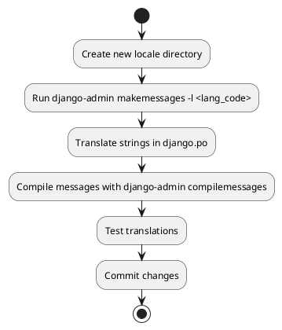
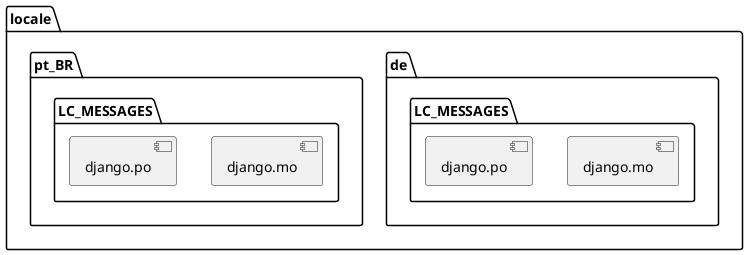

# Internationalization (i18n) Support for Accounting Module

## 1. Introduction

### Purpose of the Folder
This folder contains internationalization (i18n) resources for the koalixcrm accounting module, enabling multi-language support through Django's translation system.

### Contents Overview
- `de/` - German language translations
- `pt_BR/` - Brazilian Portuguese translations
Each language directory follows Django's standard locale structure with LC_MESSAGES containing .mo and .po files.

## 2. Available Languages and Status

| Language | Code | Completion Status | Last Updated |
|----------|------|------------------|--------------|
| German | de | Complete | Present in django.po/mo |
| Brazilian Portuguese | pt_BR | Complete | Present in django.po/mo |

## 3. Language-Specific Documentation

### German (de)
- **Files**: 
  - django.po (6010 bytes) - Source translation file
  - django.mo (2778 bytes) - Compiled translation file
- **Coverage**: Complete translation coverage for accounting module
- **Special Considerations**:
  - Formal address forms ("Sie" instead of "du")
  - Specific accounting terminology aligned with German standards

### Brazilian Portuguese (pt_BR)
- **Files**:
  - django.po (7519 bytes) - Source translation file
  - django.mo (4242 bytes) - Compiled translation file
- **Coverage**: Complete translation coverage for accounting module
- **Special Considerations**:
  - Brazilian-specific accounting terms
  - Compliance with Brazilian accounting standards

## 4. Translation Workflow

### Adding New Translations


### Updating Existing Translations
1. Update source strings in Python code
2. Run `django-admin makemessages -l <lang_code>`
3. Update translations in django.po
4. Compile with `django-admin compilemessages`
5. Test and commit

### Translation String Management
- Use gettext markers in Python code: `_("string to translate")`
- Maintain context with `pgettext("context", "string")`
- Handle plurals with `ngettext`

## 5. Best Practices

### Writing Translatable Strings
- Use complete sentences
- Avoid string concatenation
- Include context markers where meaning is ambiguous
- Use named format placeholders: `_("Balance: %(amount)s")`

### Managing Translation Files
- Keep .po files under version control
- Include compiled .mo files in deployment
- Regular updates with source strings
- Document context in translator comments

### Testing Translations
- Test with language setting in Django
- Verify special characters display
- Check format string placeholders
- Validate plural forms

## 6. File Structure



## 7. Common Issues and Solutions

### Character Encoding
- **Issue**: Special characters not displaying correctly
- **Solution**: Ensure UTF-8 encoding in .po files and database

### Missing Translations
- **Issue**: Fallback to source language
- **Solution**: Regular makemessages and translation updates

### Context Ambiguity
- **Issue**: Incorrect translations due to context
- **Solution**: Use pgettext with context markers

### Plural Forms
- **Issue**: Incorrect plural handling
- **Solution**: Use ngettext and verify plural rules

## 8. Translation Management Tools

### Built-in Django Tools
- django-admin makemessages
- django-admin compilemessages

### Recommended External Tools
- Poedit - GUI for .po file editing
- django-rosetta - Web interface for translations
- i18n-check - Translation completeness checker

## 9. Maintenance Guidelines

### Regular Tasks
- Update source strings
- Verify translation completeness
- Test with target languages
- Update documentation

### Quality Checks
- Validate format strings
- Check character encodings
- Verify plural forms
- Test in context
- Review translation context and usage


## 10. Version History

### Translation Timeline
```plantuml
@startuml
scale 1.5
skinparam backgroundColor transparent
skinparam handwritten false

timeline
  ' Initial Release
  2018 : Initial Release
  ' German Support
  : + German (de)
    ** Complete translation
    ** Formal address forms
    ** German accounting standards
  
  2019 : + Brazilian Portuguese (pt_BR)
    ** Complete translation
    ** Brazilian accounting terms
    ** Compliance with local standards
  
  2020 : Updates
    ** German translations refined
    ** Terminology standardization
    
  2021 : Quality Improvements
    ** Context markers added
    ** Enhanced plural handling
    ** Documentation updates
@enduml
```

### Version Changes
| Version | Date | Changes |
|---------|------|---------|
| 1.0.0   | 2018 | - Initial release with German language support |
| 1.1.0   | 2019 | - Added Brazilian Portuguese support |
| 1.2.0   | 2020 | - German translations refinement<br>- Standardized terminology |
| 1.3.0   | 2021 | - Added context markers<br>- Improved plural handling |

### Language Support Evolution
```plantuml
@startuml
scale 1.5
skinparam backgroundColor transparent

rectangle "Translation Coverage Evolution" {
  map "2018" {
    German => 100%
  }
  map "2019" {
    German => 100%
    Brazilian_Portuguese => 100%
  }
  map "2020" {
    German => 100%
    Brazilian_Portuguese => 100%
  }
  map "2021" {
    German => 100%
    Brazilian_Portuguese => 100%
  }
}
@enduml
```

## 11. Migration Guidelines

### Translation Update Procedures
1. **Before Updates**
   - Backup existing .po files
   - Document current translation status
   - Note any custom translations

2. **During Updates**
   - Follow version-specific migration notes
   - Update translations incrementally
   - Test each language after updates

3. **After Updates**
   - Verify translation completeness
   - Update documentation
   - Test in production environment

### Backward Compatibility
- Maintain support for older Django versions
- Keep deprecated terms with translations
- Document breaking changes in translations

### Version-Specific Notes
- **1.0.0 to 1.1.0**
  - No breaking changes
  - Added Brazilian Portuguese support
  - All German translations maintained

- **1.1.0 to 1.2.0**
  - Refined German translations
  - Standardized terminology across languages
  - No breaking changes
  - Updated documentation format

- **1.2.0 to 1.3.0**
  - Added context markers (requires translation review)
  - Enhanced plural handling system
  - Requires recompilation of .mo files
  - Updated translation documentation
  - Backward compatible with proper migration

