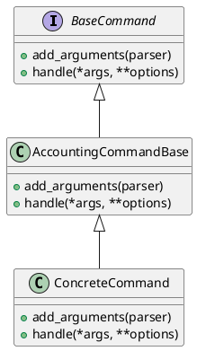
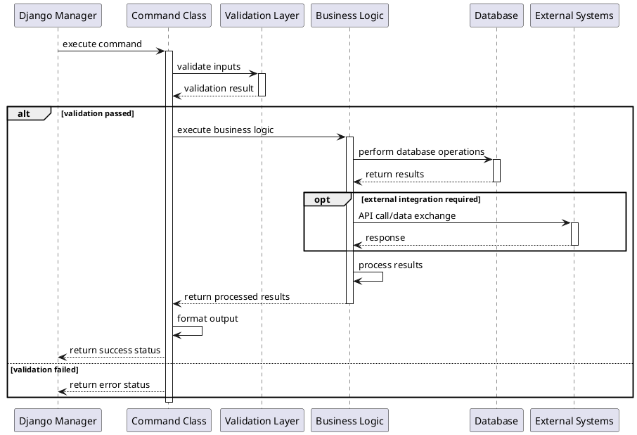

# Accounting Management Commands

## 1. Introduction

### Purpose of the Folder
This folder contains Django management commands specifically designed for the accounting module of KoalixCRM. These commands provide CLI interfaces for performing accounting-related administrative tasks, data management, and automated processes.

### Contents Overview
- `__init__.py`: Package identifier
- `commands/`: Directory containing individual management command implementations
  - `__init__.py`: Package identifier for commands

## 2. Detailed Classes and Functions Description

### Base Command Structure
```python
from django.core.management.base import BaseCommand

class AccountingCommandBase(BaseCommand):
    """Base class for accounting management commands"""
    
    def add_arguments(self, parser):
        """Define command arguments"""
        pass

    def handle(self, *args, **options):
        """Implement command logic"""
        pass
```

### Recommended Command Template
```python
from accounting.management.commands import AccountingCommandBase

class Command(AccountingCommandBase):
    help = 'Command description'

    def add_arguments(self, parser):
        parser.add_argument('--arg-name',
            type=str,
            help='Argument description')

    def handle(self, *args, **options):
        # Implement command logic
        pass
```

## 3. Design Patterns Used

### Command Pattern
The management commands follow the Command design pattern, encapsulating all information needed to perform an action or trigger an event.



## 4. Implementation Guidelines

### Creating New Commands
1. Create a new Python file in the `commands/` directory
2. Implement the Command class inheriting from AccountingCommandBase
3. Define command arguments in add_arguments()
4. Implement command logic in handle()

### Command Execution Flow


### Implementation Examples

#### 1. Account Reconciliation Command
```python
from django.core.management.base import CommandError
from accounting.management.commands import AccountingCommandBase
from accounting.models import Account, Transaction
from datetime import datetime

class Command(AccountingCommandBase):
    help = 'Reconcile account transactions for a given period'

    def add_arguments(self, parser):
        parser.add_argument('--account-id', type=int, required=True,
            help='ID of the account to reconcile')
        parser.add_argument('--start-date', type=str, required=True,
            help='Start date (YYYY-MM-DD)')
        parser.add_argument('--end-date', type=str, required=True,
            help='End date (YYYY-MM-DD)')
        parser.add_argument('--auto-match', action='store_true',
            help='Automatically match transactions')

    def handle(self, *args, **options):
        try:
            # Input validation
            account = Account.objects.get(id=options['account_id'])
            start_date = datetime.strptime(options['start_date'], '%Y-%m-%d')
            end_date = datetime.strptime(options['end_date'], '%Y-%m-%d')

            # Get transactions
            transactions = Transaction.objects.filter(
                account=account,
                date__range=(start_date, end_date)
            )

            # Reconciliation logic
            unmatched = self.reconcile_transactions(
                transactions, 
                auto_match=options['auto_match']
            )

            # Output results
            self.stdout.write(
                self.style.SUCCESS(
                    f'Reconciliation complete. {len(unmatched)} unmatched transactions'
                )
            )

        except Account.DoesNotExist:
            raise CommandError(f"Account {options['account_id']} not found")
        except ValueError as e:
            raise CommandError(f"Invalid date format: {str(e)}")
        except Exception as e:
            raise CommandError(f"Reconciliation failed: {str(e)}")

    def reconcile_transactions(self, transactions, auto_match=False):
        # Implementation of reconciliation logic
        pass
```

#### 2. Financial Report Generation Command
```python
from django.core.management.base import CommandError
from accounting.management.commands import AccountingCommandBase
from accounting.models import Account, Transaction, FinancialReport
from accounting.services import ReportGenerator
from datetime import datetime
import csv

class Command(AccountingCommandBase):
    help = 'Generate financial reports for a specified period'

    def add_arguments(self, parser):
        parser.add_argument('--report-type', type=str, required=True,
            choices=['balance-sheet', 'profit-loss', 'cash-flow'],
            help='Type of report to generate')
        parser.add_argument('--period', type=str, required=True,
            help='Reporting period (YYYY-MM)')
        parser.add_argument('--format', type=str, default='pdf',
            choices=['pdf', 'csv', 'xlsx'],
            help='Output format')
        parser.add_argument('--include-details', action='store_true',
            help='Include detailed transaction records')

    def handle(self, *args, **options):
        try:
            # Parse period
            period = datetime.strptime(options['period'], '%Y-%m')
            
            # Initialize report generator
            generator = ReportGenerator(
                report_type=options['report_type'],
                period=period,
                include_details=options['include_details']
            )

            # Generate report
            report = generator.generate()

            # Export in specified format
            output_file = self.export_report(report, options['format'])

            self.stdout.write(
                self.style.SUCCESS(
                    f"Report generated successfully: {output_file}"
                )
            )

        except ValueError as e:
            raise CommandError(f"Invalid period format: {str(e)}")
        except Exception as e:
            raise CommandError(f"Report generation failed: {str(e)}")

    def export_report(self, report, format_type):
        # Implementation of export logic
        pass
```

#### 3. Batch Transaction Processing Command
```python
from django.core.management.base import CommandError
from accounting.management.commands import AccountingCommandBase
from accounting.models import Transaction, Account
from accounting.services import TransactionProcessor
from decimal import Decimal
import csv
import logging

class Command(AccountingCommandBase):
    help = 'Process batch transactions from CSV file'

    def add_arguments(self, parser):
        parser.add_argument('--input-file', type=str, required=True,
            help='Path to CSV file containing transactions')
        parser.add_argument('--dry-run', action='store_true',
            help='Validate without committing changes')
        parser.add_argument('--error-file', type=str,
            help='Path to output file for failed transactions')
        parser.add_argument('--batch-size', type=int, default=100,
            help='Number of transactions to process in each batch')

    def handle(self, *args, **options):
        logger = logging.getLogger(__name__)
        failed_transactions = []

        try:
            with open(options['input_file'], 'r') as file:
                reader = csv.DictReader(file)
                transactions = []
                
                for row in reader:
                    try:
                        transaction = self.validate_transaction(row)
                        transactions.append(transaction)
                        
                        if len(transactions) >= options['batch_size']:
                            self.process_batch(
                                transactions,
                                dry_run=options['dry_run']
                            )
                            transactions = []
                            
                    except ValueError as e:
                        failed_transactions.append({**row, 'error': str(e)})
                        logger.error(f"Invalid transaction: {str(e)}")

                # Process remaining transactions
                if transactions:
                    self.process_batch(transactions, dry_run=options['dry_run'])

            # Write failed transactions to file if specified
            if options['error_file'] and failed_transactions:
                self.write_failed_transactions(
                    failed_transactions,
                    options['error_file']
                )

            self.stdout.write(
                self.style.SUCCESS(
                    f"Processing complete. {len(failed_transactions)} failures."
                )
            )

        except FileNotFoundError:
            raise CommandError(f"Input file not found: {options['input_file']}")
        except Exception as e:
            raise CommandError(f"Processing failed: {str(e)}")

    def validate_transaction(self, row):
        # Implement transaction validation logic
        pass

    def process_batch(self, transactions, dry_run=False):
        # Implement batch processing logic
        pass

    def write_failed_transactions(self, transactions, output_file):
        # Implement error reporting logic
        pass
```

## 6. Best Practices

### Command Development
1. Follow single responsibility principle
2. Implement proper error handling
3. Add comprehensive help text
4. Include logging for debugging
5. Write unit tests
6. Implement transaction rollback mechanisms
7. Add progress indicators for long-running operations
8. Include data validation checks
9. Provide dry-run options for destructive operations
10. Implement proper cleanup procedures

### Accounting-Specific Guidelines
1. Ensure double-entry accounting principles
   - Validate debits equal credits
   - Maintain account balance integrity
   - Implement transaction reversals properly

2. Maintain audit trails
   - Log all financial transactions
   - Record user actions and changes
   - Store transaction metadata

3. Implement reconciliation checks
   - Compare internal and external records
   - Validate account balances
   - Track unreconciled items

4. Handle numerical precision
   - Use Decimal for monetary values
   - Implement proper rounding rules
   - Handle currency conversions accurately

5. Support multi-currency operations
   - Store exchange rates
   - Handle currency conversions
   - Track gains and losses

6. Provide detailed error reporting
   - Include transaction IDs
   - Record error contexts
   - Maintain error logs

7. Include balance validation
   - Check account balances
   - Verify trial balances
   - Validate subsidiary ledgers

8. Support accounting period constraints
   - Enforce period closures
   - Handle year-end processes
   - Manage period adjustments

9. Implement proper backup procedures
   - Backup before batch operations
   - Store transaction history
   - Archive old records

10. Follow regulatory compliance
    - Meet local accounting standards
    - Support tax reporting
    - Maintain required records

### Testing Strategies

#### 1. Unit Testing
```python
from django.test import TestCase
from django.core.management import call_command
from accounting.models import Account, Transaction
from decimal import Decimal

class ReconciliationCommandTest(TestCase):
    def setUp(self):
        self.account = Account.objects.create(
            name="Test Account",
            type="asset"
        )
        self.transaction = Transaction.objects.create(
            account=self.account,
            amount=Decimal('100.00'),
            date='2023-01-01'
        )

    def test_reconciliation_command(self):
        args = []
        opts = {
            'account_id': self.account.id,
            'start_date': '2023-01-01',
            'end_date': '2023-01-31'
        }
        call_command('reconcile_accounts', *args, **opts)
        
        # Verify reconciliation results
        self.account.refresh_from_db()
        self.assertTrue(self.account.is_reconciled)
```

#### 2. Integration Testing
```python
class BatchProcessingTest(TestCase):
    def test_batch_transaction_processing(self):
        # Prepare test data
        test_file = 'test_transactions.csv'
        self.create_test_csv(test_file)

        try:
            call_command('process_transactions',
                input_file=test_file,
                batch_size=10
            )
            )

            # Verify results
            self.assertEqual(
                Transaction.objects.count(),
                expected_count
            )
            self.verify_account_balances()

        finally:
            # Cleanup
            os.remove(test_file)

    def verify_account_balances(self):
        # Verify all accounts are balanced
        for account in Account.objects.all():
            self.assertEqual(
                account.calculate_balance(),
                account.reported_balance
            )
```

### Error Handling Patterns

#### 1. Transaction Validation Errors
```python
class TransactionValidationError(CommandError):
    def __init__(self, message, transaction_data=None):
        self.transaction_data = transaction_data
        super().__init__(message)

def validate_transaction(self, data):
    if not data.get('amount'):
        raise TransactionValidationError(
            "Amount is required",
            transaction_data=data
        )
    
    try:
        amount = Decimal(data['amount'])
        if amount <= 0:
            raise TransactionValidationError(
                "Amount must be positive",
                transaction_data=data
            )
    except (TypeError, ValueError):
        raise TransactionValidationError(
            "Invalid amount format",
            transaction_data=data
        )
```

#### 2. Period Validation
```python
def validate_accounting_period(self, date):
    period = AccountingPeriod.objects.get_period(date)
    
    if period.is_closed:
        raise CommandError(
            f"Accounting period {period} is closed"
        )
    
    if period.is_locked:
        raise CommandError(
            f"Accounting period {period} is locked for review"
        )
```

### Monitoring and Logging

#### 1. Performance Monitoring
```python
import time
from functools import wraps

def monitor_performance(command_name):
    def decorator(func):
        @wraps(func)
        def wrapper(self, *args, **kwargs):
            start_time = time.time()
            result = func(self, *args, **kwargs)
            execution_time = time.time() - start_time
            
            # Log performance metrics
            logger.info(
                f"Command {command_name} completed in {execution_time:.2f} seconds"
            )
            
            # Store metrics for analysis
            CommandMetrics.objects.create(
                command=command_name,
                execution_time=execution_time,
                processed_records=getattr(self, 'processed_count', 0)
            )
            
            return result
        return wrapper
    return decorator
```
```

#### 2. Audit Logging
```python
class AuditLogMixin:
    def log_audit_event(self, event_type, details):
        AuditLog.objects.create(
            command=self.__class__.__name__,
            event_type=event_type,
            user=self.get_user(),
            details=details,
            timestamp=timezone.now()
        )

    def get_user(self):
        return self.user if hasattr(self, 'user') else None
```

### Data Integrity Patterns

#### 1. Transaction Atomicity
```python
from django.db import transaction
from django.core.management.base import CommandError

class AtomicTransactionMixin:
    def execute_atomic(self, operations):
        try:
            with transaction.atomic():
                for operation in operations:
                    operation()
                self.log_audit_event('transaction_complete', {
                    'operations_count': len(operations)
                })
        except Exception as e:
            self.log_audit_event('transaction_failed', {
                'error': str(e)
            })
            raise CommandError(f"Transaction failed: {str(e)}")
```

#### 2. Data Consistency Checks
```python
class ConsistencyCheckMixin:
    def verify_account_consistency(self):
        # Verify trial balance
        debit_sum = Account.objects.filter(
            type__in=['asset', 'expense']
        ).aggregate(Sum('balance'))['balance__sum'] or 0

        credit_sum = Account.objects.filter(
            type__in=['liability', 'equity', 'revenue']
        ).aggregate(Sum('balance'))['balance__sum'] or 0

        if debit_sum != credit_sum:
            raise CommandError(
                f"Trial balance mismatch: DR={debit_sum}, CR={credit_sum}"
            )
```

### Command Scheduling and Automation

#### 1. Scheduled Command Configuration
```python
from django_celery_beat.models import PeriodicTask, IntervalSchedule

def schedule_reconciliation():
    schedule, _ = IntervalSchedule.objects.get_or_create(
        every=1,
        period=IntervalSchedule.DAYS,
    )
    
    PeriodicTask.objects.create(
        interval=schedule,
        name='Daily Account Reconciliation',
        task='accounting.tasks.run_reconciliation',
        kwargs=json.dumps({
            'accounts': 'all',
            'notify_errors': True
        })
    )
```

#### 2. Command Dependencies
```python
class DependencyCheckMixin:
    required_commands = ['reconcile_accounts', 'generate_reports']

    def check_dependencies(self):
        from django.core.management import get_commands
        available_commands = get_commands()
        
        missing = [cmd for cmd in self.required_commands 
                  if cmd not in available_commands]
        
        if missing:
            raise CommandError(
                f"Missing required commands: {', '.join(missing)}"
            )
```

### Command Output and Progress Reporting

#### 1. Progress Bar Implementation
```python
from django.core.management.base import OutputWrapper
from tqdm import tqdm

class ProgressMixin:
    def init_progress_bar(self, total, desc="Processing"):
        self.progress_bar = tqdm(
            total=total,
            desc=desc,
            file=OutputWrapper(self.stdout)
        )

    def update_progress(self, amount=1):
        if hasattr(self, 'progress_bar'):
            self.progress_bar.update(amount)

    def finish_progress(self):
        if hasattr(self, 'progress_bar'):
            self.progress_bar.close()
```

#### 2. Structured Output Formatting
```python
class FormattedOutputMixin:
    def print_table(self, headers, rows):
        # Calculate column widths
        widths = [len(h) for h in headers]
        for row in rows:
            for i, cell in enumerate(row):
                widths[i] = max(widths[i], len(str(cell)))

        # Print headers
        header_line = ' | '.join(
            h.ljust(w) for h, w in zip(headers, widths)
        )
        self.stdout.write(header_line)
        self.stdout.write('-' * len(header_line))

        # Print rows
        for row in rows:
            self.stdout.write(
                ' | '.join(
                    str(cell).ljust(w) for cell, w in zip(row, widths)
                )
            )

    def print_summary(self, title, data):
        self.stdout.write(self.style.MIGRATE_HEADING(f"\n{title}"))
        for key, value in data.items():
            self.stdout.write(f"{key}: {value}")
```

### Configuration Management

#### 1. Command Settings
```python
from django.conf import settings

class ConfigurationMixin:
    def get_setting(self, name, default=None):
        return getattr(
            settings,
            f'ACCOUNTING_COMMAND_{name.upper()}',
            default
        )

    def load_configuration(self):
        self.batch_size = self.get_setting('batch_size', 100)
        self.timeout = self.get_setting('timeout', 3600)
        self.notification_email = self.get_setting(
            'notification_email',
            'finance@example.com'
        )
```

#### 2. Environment-Specific Configuration
```python
class EnvironmentAwareCommand(AccountingCommandBase):
    def initialize_command(self):
        self.environment = self.get_environment()
        self.load_environment_config()
        self.configure_logging()

    def get_environment(self):
        return getattr(settings, 'ENVIRONMENT', 'production')

    def load_environment_config(self):
        config_map = {
            'development': {
                'validate_strictly': False,
                'allow_backdated': True,
                'debug_logging': True
            },
            'staging': {
                'validate_strictly': True,
                'allow_backdated': True,
                'debug_logging': True
            },
            'production': {
                'validate_strictly': True,
                'allow_backdated': False,
                'debug_logging': False
            }
        }
        self.config = config_map.get(self.environment, {})
```

### Command Integration Patterns

#### 1. Command Chaining
```python
class ChainedCommandMixin:
    def execute_chain(self, commands):
        """Execute a series of commands in sequence"""
        results = []
        for cmd_name, cmd_opts in commands:
            try:
                result = call_command(cmd_name, **cmd_opts)
                results.append((cmd_name, True, result))
            except Exception as e:
                results.append((cmd_name, False, str(e)))
                if not self.continue_on_error:
                    raise
        return results
```

#### 2. Command Notifications
```python
from django.core.mail import send_mail

class NotificationMixin:
    def notify_completion(self, success, details):
        subject = f"Command {self.__class__.__name__} "
        subject += "completed successfully" if success else "failed"
        
        message = f"Command: {self.__class__.__name__}\n"
        message += f"Status: {'Success' if success else 'Failed'}\n"
        message += f"Details:\n{details}"
        
        send_mail(
            subject=subject,
            message=message,
            from_email=settings.DEFAULT_FROM_EMAIL,
            recipient_list=[self.notification_email],
            fail_silently=True
        )
```

### Troubleshooting Guidelines

#### 1. Common Issues and Solutions

1. Transaction Failures
   ```bash
   # Check transaction logs
   python manage.py check_transactions --status=failed --period=last-24h
   
   # Retry failed transactions
   python manage.py retry_transactions --batch=failed-20231110
   ```

2. Balance Discrepancies
   ```bash
   # Verify account balances
   python manage.py verify_balances --account-type=all --detailed
   
   # Find unbalanced transactions
   python manage.py find_discrepancies --from-date=2023-01-01
   ```

3. Performance Issues
   ```bash
   # Analyze command performance
   python manage.py analyze_performance --command=reconcile_accounts --period=30d
   
   # Optimize database operations
   python manage.py optimize_db --analyze --vacuum
   ```

#### 2. Debug Mode Operations
```bash
# Enable detailed logging
python manage.py reconcile_accounts --debug --log-level=DEBUG

# Dry run with validation
python manage.py process_transactions --dry-run --validate-only

# Performance profiling
python manage.py generate_reports --profile --output-stats
```

### Best Practices Summary

1. Command Implementation
   - Follow single responsibility principle
   - Implement proper error handling
   - Use atomic transactions
   - Include comprehensive logging
   - Add progress indicators
   - Validate all inputs
   - Support dry-run mode
   - Implement proper cleanup
   - Add command documentation
   - Include usage examples

2. Data Management
   - Validate all inputs
   - Maintain data consistency
   - Implement proper backups
   - Handle edge cases
   - Support rollback operations
   - Verify data integrity
   - Track audit trails
   - Handle concurrent access
   - Implement data archiving
   - Manage data retention

3. Performance Optimization
   - Use batch processing
   - Implement caching
   - Optimize database queries
   - Monitor resource usage
   - Handle timeouts properly
   - Use async operations when appropriate
   - Implement pagination
   - Profile command execution
   - Optimize memory usage
   - Use database indexes effectively

4. Security Considerations
   - Validate user permissions
   - Secure sensitive data
   - Log security events
   - Implement rate limiting
   - Follow compliance requirements
   - Handle sensitive data properly
   - Implement access controls
   - Secure configuration data
   - Monitor command usage
   - Regular security audits

### Command Versioning and Deprecation

#### 1. Version Management
```python
class VersionedCommand(AccountingCommandBase):
    version = '1.0.0'
    deprecated = False
    deprecation_message = None
    
    def __init__(self):
        super().__init__()
        self.check_deprecation()
    
    def check_deprecation(self):
        if self.deprecated:
            warning = f"Warning: {self.__class__.__name__} is deprecated"
            if self.deprecation_message:
                warning += f". {self.deprecation_message}"
            warnings.warn(warning, DeprecationWarning, stacklevel=2)
```

#### 2. Command Migration
```python
class MigratableCommand(VersionedCommand):
    def handle(self, *args, **options):
        if self.needs_migration():
            self.stdout.write(
                self.style.WARNING(
                    "This command needs migration. "
                    "Please run upgrade_command first."
                )
            )
            return
        
        self.execute_command(*args, **options)
    
    def needs_migration(self):
        return self.get_command_version() < self.version
    
    def get_command_version(self):
        # Implementation to get stored command version
        pass
```

#### 3. Backward Compatibility
```python
class BackwardCompatibleCommand(VersionedCommand):
    def add_arguments(self, parser):
        super().add_arguments(parser)
        # Add new arguments while maintaining backward compatibility
        parser.add_argument(
            '--legacy-mode',
            action='store_true',
            help='Run command in legacy mode for backward compatibility'
        )
    
    def handle(self, *args, **options):
        if options.get('legacy_mode'):
            return self.handle_legacy(*args, **options)
        return self.handle_current(*args, **options)
```

### Command Maintenance and Lifecycle

#### 1. Command Status Tracking
```python
from enum import Enum

class CommandStatus(Enum):
    ACTIVE = 'active'
    DEPRECATED = 'deprecated'
    MAINTENANCE = 'maintenance'
    BETA = 'beta'

class MaintainableCommand(AccountingCommandBase):
    status = CommandStatus.ACTIVE
    maintenance_message = None
    
    def check_status(self):
        if self.status != CommandStatus.ACTIVE:
            message = f"Command status: {self.status.value}"
            if self.maintenance_message:
                message += f"\n{self.maintenance_message}"
            self.stdout.write(self.style.WARNING(message))
```

#### 2. Command Documentation Updates
```python
class DocumentedCommand(AccountingCommandBase):
    """Base class for commands with automated documentation."""
    
    def get_documentation(self):
        """Generate command documentation."""
        doc = [
            f"# {self.__class__.__name__}",
            "",
            self.__doc__ or "No description available.",
            "",
            "## Arguments",
        ]
        
        # Document arguments
        parser = self.create_parser("", self.__class__.__name__)
        for action in parser._actions:
            if action.dest != 'help':
                doc.append(f"* `{action.dest}`: {action.help}")
        
        # Add examples
        if hasattr(self, 'examples'):
            doc.extend(["", "## Examples"])
            for example in self.examples:
                doc.extend([
                    f"### {example['description']}",
                    "```bash",
                    example['command'],
                    "```"
                ])
        
        return "\n".join(doc)
```

### Final Notes

#### 1. Command Lifecycle Management
- Regular review of command usage and performance
- Deprecation planning for outdated commands
- Documentation updates for changes
- Version control and tagging
- Change notification process

#### 2. Maintenance Procedures
- Regular code reviews
- Performance monitoring
- Security audits
- Dependency updates
- Database optimization

#### 3. Support Guidelines
- Issue tracking process
- Bug reporting templates
- Feature request handling
- User documentation
- Training materials

#### 4. Quality Assurance
- Automated testing
- Code coverage requirements
- Performance benchmarks
- Security scanning
- Compliance checks

#### 5. Deployment Strategy
- Version control workflow
- Release planning
- Rollback procedures
- Database migrations
- Configuration management

### External System Integration

#### 1. API Integration
```python
class APIIntegratedCommand(AccountingCommandBase):
    """Base class for commands that interact with external APIs."""
    
    def setup_api_client(self):
        self.api_client = ExternalAPIClient(
            base_url=settings.API_BASE_URL,
            api_key=settings.API_KEY,
            timeout=self.get_setting('api_timeout', 30)
        )
    
    def handle_api_error(self, error):
        self.log_audit_event('api_error', {
            'error_type': type(error).__name__,
            'error_message': str(error)
        })
        raise CommandError(f"API Error: {str(error)}")
```

#### 2. File Export Integration
```python
class ExportCommand(AccountingCommandBase):
    """Base class for export commands."""
    
    supported_formats = ['csv', 'xlsx', 'pdf']
    
    def export_data(self, data, format_type):
        if format_type not in self.supported_formats:
            raise CommandError(f"Unsupported format: {format_type}")
        
        exporter = self.get_exporter(format_type)
        return exporter.export(data)
    
    def get_exporter(self, format_type):
        exporters = {
            'csv': CSVExporter(),
            'xlsx': ExcelExporter(),
            'pdf': PDFExporter()
        }
        return exporters[format_type]
```

### Documentation Structure Summary

#### 1. Core Sections
1. Introduction
   - Purpose and scope
   - Module overview
   - Basic concepts

2. Command Implementation
   - Base classes
   - Common patterns
   - Best practices
   - Example implementations

3. Data Management
   - Validation patterns
   - Consistency checks
   - Backup procedures
   - Audit requirements

4. Security and Performance
   - Security considerations
   - Performance optimization
   - Monitoring and logging
   - Error handling

5. Integration and Deployment
   - External system integration
   - Deployment procedures
   - Version management
   - Maintenance guidelines

#### 2. Supporting Materials
1. Code Examples
   - Implementation samples
   - Usage patterns
   - Integration examples
   - Testing approaches

2. Best Practices
   - Development guidelines
   - Security protocols
   - Performance tips
   - Maintenance procedures

3. Troubleshooting
   - Common issues and solutions
   - Debugging procedures
   - Error resolution guides
   - Performance optimization tips
   - System health checks

4. Reference Materials
   - Command reference guide
   - API documentation
   - Configuration options
   - Deployment checklist
   - Security guidelines

### Final Notes

1. Documentation Maintenance
   - Keep README-AI.md updated
   - Document all command changes
   - Include migration guides
   - Maintain changelog
   - Update example usage

2. Testing Requirements
   - Unit test coverage
   - Integration testing
   - Performance testing
   - Security testing
   - Regression testing

3. Deployment Considerations
   - Version control
   - Change management
   - Rollback procedures
   - Monitoring setup
   - Backup strategies

### Conclusion

The accounting management commands documentation provides a comprehensive framework for implementing, maintaining, and extending the accounting functionality in KoalixCRM. Key aspects covered include:

1. Implementation
   - Structured command development
   - Best practices and patterns
   - Error handling and validation
   - Performance optimization

2. Maintenance
   - Version control and updates
   - Testing and quality assurance
   - Documentation management
   - Support procedures

3. Integration
   - External system connectivity
   - Data import/export
   - API integration
   - File handling

4. Security
   - Access control
   - Data protection
   - Audit compliance
   - Security best practices

For the latest updates and support:

- Project Repository: [GitHub Repository]
- Documentation: [Project Documentation]
- Issue Tracker: [Issue Management]
- Support Channel: [Community Forum]

This documentation is maintained by the KoalixCRM development team and community contributors. Regular updates are made to reflect system changes, new features, and community feedback. Contributors are encouraged to submit improvements and corrections through the project's standard contribution process.
