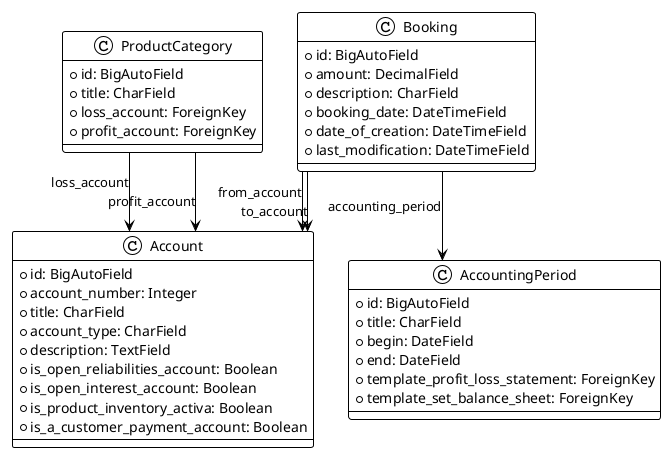
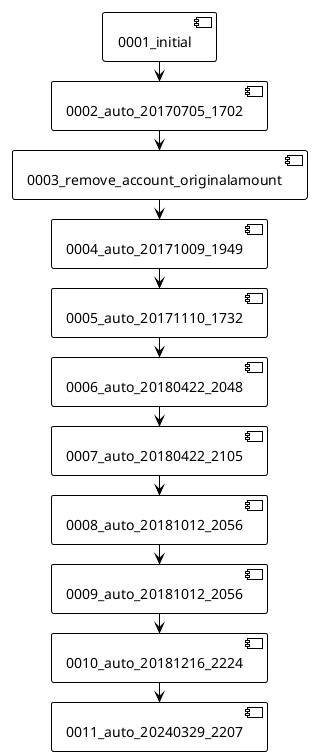
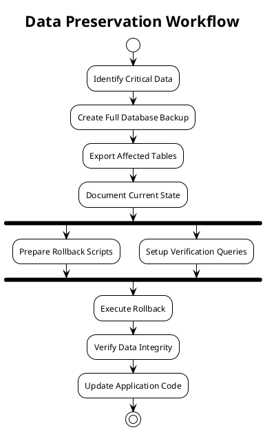
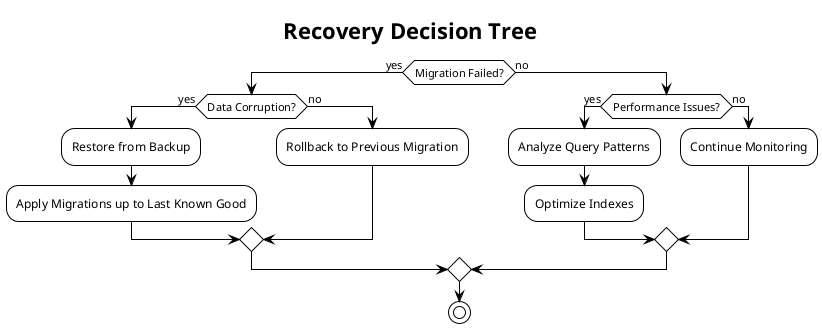
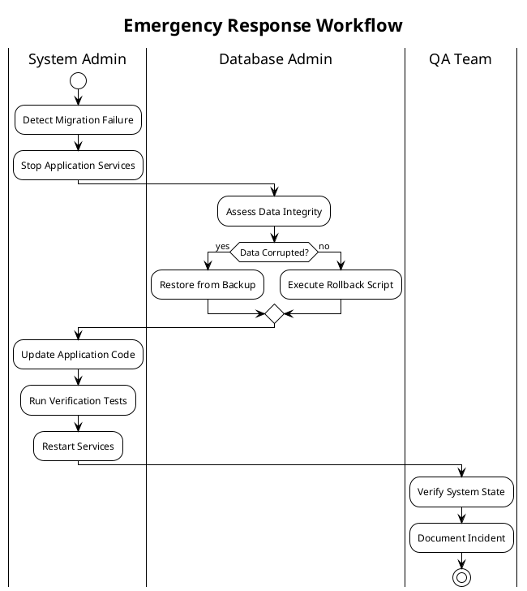

# Accounting Migrations Documentation

## 1. Overview of the Migration System

The migrations system in the accounting module manages the evolution of the database schema for KoalixCRM's accounting functionality. It handles the creation and modification of tables related to accounts, bookings, accounting periods, and product categories.

## 2. Chronological List of Migrations

1. `0001_initial.py` (2017-07-05)
   - Initial setup of core accounting models
   - Created Account, AccountingPeriod, Booking, and ProductCategorie models

2. `0002_auto_20170705_1702.py` (2017-07-05)
   - Added relationships between models
   - Established foreign key connections for bookings

3. `0003_remove_account_originalamount.py` (2017-07-07)
   - Removed originalAmount field from Account model

4. `0004_auto_20171009_1949.py` (2017-10-09)
   - Added German translations
   - Modified model options and field labels

5. `0005_auto_20171110_1732.py` (2017-11-10)
   - Reverted to English translations
   - Updated field verbose names

6. `0006_auto_20180422_2048.py` (2018-04-22)
   - Renamed fields to follow Python naming conventions
   - Added template_set field to AccountingPeriod

7. `0007_auto_20180422_2105.py` (2018-04-22)
   - Split template_set into specific template fields
   - Added profit/loss statement and balance sheet templates

8. `0008_auto_20181012_2056.py` (2018-10-12)
   - Created new ProductCategory model

9. `0009_auto_20181012_2056.py` (2018-10-12)
   - Migrated from ProductCategorie to ProductCategory
   - Updated field names and relationships

10. `0010_auto_20181216_2224.py` (2018-12-16)
    - Added staff-only restrictions to user fields
    - Added account type restrictions to profit/loss accounts

11. `0011_auto_20240329_2207.py` (2024-03-29)
    - Upgraded to BigAutoField for all primary keys

## 3. Significant Schema Changes

### Database Models Evolution



## 4. Dependencies Between Migrations



## 5. Best Practices

### Handling Migrations During Deployment

1. Always backup the database before applying migrations
2. Run migrations in a staging environment first
3. Use `python manage.py showmigrations` to verify pending migrations
4. Apply migrations using `python manage.py migrate accounting`
5. Verify the application's functionality after migration

### Creating New Migrations

1. Make model changes in models.py
2. Generate migration file: `python manage.py makemigrations accounting`
3. Review the generated migration file
4. Add appropriate documentation comments
5. Test the migration in a development environment

### Resolving Migration Conflicts

1. Never modify existing migrations in production
2. Use `python manage.py migrate accounting --fake` when needed
3. Keep track of migration state in different environments
4. Use squash migrations for long migration histories
5. Document any manual intervention required

## 6. Migration Rollback Procedures

### 6.1 Standard Rollback Procedures
```bash
# Rollback to specific migration
python manage.py migrate accounting <previous_migration_name>

# Verify rollback success
python manage.py showmigrations accounting
```

### 6.2 Common Rollback Scenarios

#### Account Model Changes (0003, 0010)
1. Backup affected account data
2. Rollback to previous migration
3. Verify account balances and relationships
4. Update application code to match schema
5. Run integrity checks on financial data

#### Product Category Migration (0008, 0009)
1. Export product category mappings
2. Rollback database schema
3. Restore previous category relationships
4. Verify product assignments
5. Update related inventory records

#### Template Changes (0006, 0007)
1. Archive existing templates
2. Rollback template-related changes
3. Restore previous template configurations
4. Verify report generation
5. Update template references

### 6.3 Data Preservation Strategies



### 6.4 Recovery Procedures



## 7. Troubleshooting Guide

### 7.1 Common Migration Issues

#### Data Integrity Problems
- **Symptom**: Inconsistent account balances
- **Solution**: 
  1. Run validation queries
  2. Compare against backup data
  3. Use data fixing migrations
  4. Verify transaction history

#### Dependency Conflicts
- **Symptom**: Migration dependency errors
- **Solution**:
  1. Review migration order
  2. Check for circular dependencies
  3. Squash conflicting migrations
  4. Update dependency chains

#### Performance Issues
- **Symptom**: Slow migration execution
- **Solution**:
  1. Break large migrations into smaller steps
  2. Use database-native operations
  3. Schedule during low-traffic periods
  4. Monitor resource usage

### 7.2 Emergency Procedures



## 8. Best Practices

### 8.1 Pre-Rollback Checklist
1. [ ] Create full database backup
2. [ ] Document current schema state
3. [ ] Prepare rollback scripts
4. [ ] Test rollback in staging
5. [ ] Notify stakeholders
6. [ ] Schedule maintenance window
7. [ ] Prepare verification queries
8. [ ] Update monitoring alerts

### 8.2 Testing Strategy
1. Test migrations with production-like data
2. Verify both forward and backward migrations
3. Measure performance impact
4. Test all affected business processes
5. Validate data integrity post-migration

### 8.3 Communication Protocol
1. Notify stakeholders of planned changes
2. Document rollback triggers and criteria
3. Establish emergency contact procedures
4. Maintain incident log
5. Schedule post-migration review

### 8.4 Monitoring Requirements
1. Track migration progress metrics
2. Monitor system performance
3. Set up alerts for critical failures
4. Log all schema changes
5. Document verification results

## 9. Additional Considerations

### 9.1 Data Backup Strategy
1. Implement automated backup procedures
2. Maintain multiple backup points
3. Test backup restoration regularly
4. Document backup locations and procedures
5. Verify backup integrity before rollbacks

### 9.2 Performance Monitoring
1. Establish baseline performance metrics
2. Monitor database load during migrations
3. Track query execution times
4. Set up performance alerts
5. Document performance impact

### 9.3 Security Considerations
1. Audit access controls post-migration
2. Verify data encryption status
3. Update security protocols if needed
4. Document security changes
5. Review permission changes

### 9.4 Documentation Requirements
1. Maintain detailed migration logs
2. Document all manual interventions
3. Update system architecture diagrams
4. Record performance metrics
5. Document lessons learned
