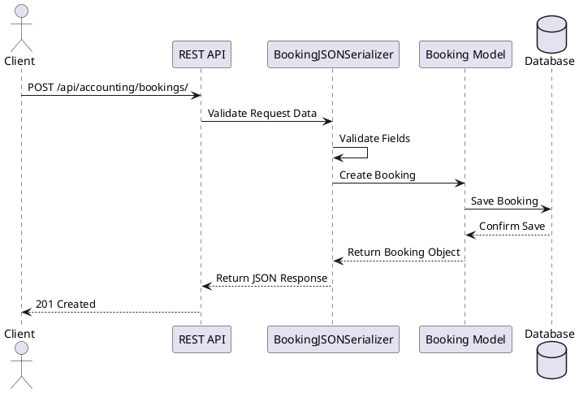
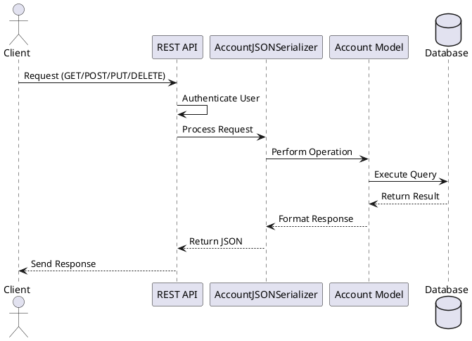
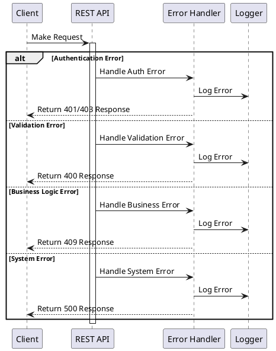
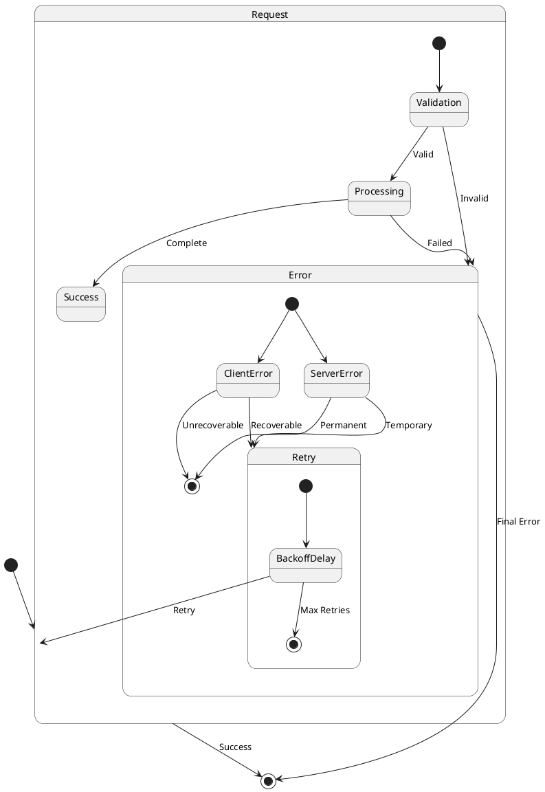
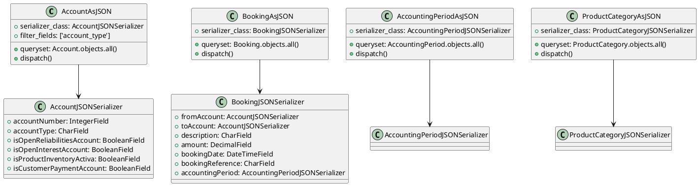

# Accounting REST API Documentation

## Introduction

The `accounting/rest` module provides a RESTful API interface for the koalixcrm accounting system. This API allows for managing accounts, bookings, accounting periods, and product categories with full CRUD operations.

## Authentication and Authorization

All API endpoints require authentication using one of the following methods:
- Session Authentication
- Basic Authentication

Every request must be made by an authenticated user with appropriate permissions (IsAuthenticated).

### Headers Required
```
Authorization: Basic <credentials>
HTTP_KOALIXCRM_USER: <username>
```

## API Endpoints

### 1. Accounts API
**Endpoint**: `/api/accounting/accounts/`
**Viewset**: `AccountAsJSON`

#### Available Methods
- GET (List/Retrieve)
- POST (Create)
- PUT (Update)
- DELETE (Delete)

#### Filter Options
- `account_type`: Filter accounts by their type

#### Request/Response Format
```json
{
    "id": integer,
    "accountNumber": integer,
    "title": string,
    "accountType": string,
    "description": string,
    "isOpenReliabilitiesAccount": boolean,
    "isOpenInterestAccount": boolean,
    "isProductInventoryActiva": boolean,
    "isCustomerPaymentAccount": boolean
}
```

### 2. Bookings API
**Endpoint**: `/api/accounting/bookings/`
**Viewset**: `BookingAsJSON`

#### Available Methods
- GET (List/Retrieve)
- POST (Create)
- PUT (Update)
- DELETE (Delete)

#### Request/Response Format
```json
{
    "id": integer,
    "fromAccount": {
        "id": integer,
        "accountNumber": integer,
        "title": string
    },
    "toAccount": {
        "id": integer,
        "accountNumber": integer,
        "title": string
    },
    "description": string,
    "amount": decimal,
    "bookingDate": "YYYY-MM-DDThh:mm",
    "staff": {
        "id": integer,
        "username": string,
        "firstName": string,
        "lastName": string
    },
    "bookingReference": string,
    "accountingPeriod": {
        "id": integer,
        "title": string
    }
}
```

### 3. Accounting Periods API
**Endpoint**: `/api/accounting/periods/`
**Viewset**: `AccountingPeriodAsJSON`

#### Available Methods
- GET (List/Retrieve)
- POST (Create)
- PUT (Update)
- DELETE (Delete)

#### Request/Response Format
```json
{
    "id": integer,
    "title": string,
    "begin": date,
    "end": date
}
```

### 4. Product Categories API
**Endpoint**: `/api/accounting/categories/`
**Viewset**: `ProductCategoryAsJSON`

#### Available Methods
- GET (List/Retrieve)
- POST (Create)
- PUT (Update)
- DELETE (Delete)

#### Request/Response Format
```json
{
    "id": integer,
    "title": string,
    "profitAccount": {
        "id": integer,
        "accountNumber": integer,
        "title": string
    },
    "lossAccount": {
        "id": integer,
        "accountNumber": integer,
        "title": string
    }
}
```

## API Flows

### Booking Creation Flow


### Account Management Flow


## Error Handling

### HTTP Status Codes
- 200: Successful operation
- 201: Resource created successfully
- 400: Bad request (validation error)
- 401: Unauthorized (authentication required)
- 403: Forbidden (insufficient permissions)
- 404: Resource not found
- 500: Internal server error

### Error Response Format
```json
{
    "error": {
        "code": "string",
        "message": "string",
        "details": {
            "field": "string",
            "reason": "string"
        },
        "timestamp": "ISO-8601 timestamp",
        "requestId": "string",
        "locale": "string"
    }
}
```

#### Standard Error Structure
- `code`: Machine-readable error code
- `message`: Human-readable error description
- `details`: Additional error context and field-specific errors
- `timestamp`: When the error occurred
- `requestId`: Unique identifier for error tracking
- `locale`: Language of error messages

#### Error Codes and Meanings
| Code                    | Description                                    |
|------------------------|------------------------------------------------|
| AUTH_INVALID           | Invalid authentication credentials             |
| AUTH_EXPIRED           | Authentication token expired                   |
| AUTH_MISSING           | Missing authentication credentials             |
| PERMISSION_DENIED      | Insufficient permissions                       |
| VALIDATION_ERROR       | Invalid input data                            |
| RESOURCE_NOT_FOUND     | Requested resource doesn't exist               |
| RESOURCE_CONFLICT      | Resource state conflict                        |
| SYSTEM_ERROR          | Internal server error                          |
| RATE_LIMIT_EXCEEDED   | Too many requests                             |

### Error Handling Guidelines

#### Common Error Scenarios
1. **Authentication Errors**
   - Invalid credentials
   - Expired tokens
   - Missing authentication headers

2. **Validation Errors**
   - Invalid data formats
   - Missing required fields
   - Business rule violations

3. **Resource Errors**
   - Non-existent resources
   - Conflicting states
   - Concurrent modifications

4. **System Errors**
   - Database connection issues
   - External service failures
   - Internal processing errors

#### Error Recovery Procedures
1. **Client-Side Recovery**
   - Refresh authentication tokens
   - Retry with exponential backoff
   - Clear cached data
   - User notification and guidance

2. **Rate Limiting Recovery**
   - Honor Retry-After headers
   - Implement request queuing
   - Reduce request frequency

### Error Examples

#### Authentication Error
```json
{
    "error": {
        "code": "AUTH_INVALID",
        "message": "Invalid authentication credentials",
        "details": {
            "field": "Authorization",
            "reason": "Invalid token format"
        },
        "timestamp": "2023-11-10T12:00:00Z",
        "requestId": "req-123456",
        "locale": "en-US"
    }
}
```

#### Validation Error
```json
{
    "error": {
        "code": "VALIDATION_ERROR",
        "message": "Invalid booking data",
        "details": {
            "amount": "Must be greater than 0",
            "bookingDate": "Cannot be in the future"
        },
        "timestamp": "2023-11-10T12:01:00Z",
        "requestId": "req-123457",
        "locale": "en-US"
    }
}
```

#### Business Logic Error
```json
{
    "error": {
        "code": "RESOURCE_CONFLICT",
        "message": "Cannot delete account with active bookings",
        "details": {
            "accountId": "123",
            "activeBookings": 5
        },
        "timestamp": "2023-11-10T12:02:00Z",
        "requestId": "req-123458",
        "locale": "en-US"
    }
}
```

### Error Handling Flow


### Error State Transitions

## Rate Limiting

The API implements standard Django REST framework rate limiting:
- Authenticated users: 100 requests per hour
- Unauthenticated users: 20 requests per hour

## Best Practices

1. Always include authentication headers
2. Use appropriate HTTP methods for operations
3. Handle pagination for list endpoints
4. Implement proper error handling
5. Follow retry strategies for rate limiting
6. Log and monitor API usage
7. Validate input data before sending
8. Handle responses asynchronously when appropriate
## Integration Examples

### Python Example
```python
import requests

# Authentication
headers = {
    'Authorization': 'Basic <credentials>',
    'HTTP_KOALIXCRM_USER': 'username'
}

# Create a booking
booking_data = {
    "fromAccount": {"id": 1},
    "toAccount": {"id": 2},
    "description": "Test booking",
    "amount": "100.00",
    "bookingDate": "2023-01-01T10:00",
    "bookingReference": "REF001",
    "accountingPeriod": {"id": 1}
}

response = requests.post(
    'http://api/accounting/bookings/',
    json=booking_data,
    headers=headers
)

if response.status_code == 201:
    print("Booking created successfully")
    print(response.json())
```

## API Versioning

Current API version: v1
Base URL: `/api/v1/accounting/`

Future versions will be implemented using URL versioning:
- `/api/v2/accounting/`
- `/api/v3/accounting/`

## Class Diagram

## Testing the API

To test the API endpoints, you can use tools like:
- cURL for command-line testing
- Postman for GUI-based testing
- Python requests library for automated testing

### Testing Guidelines
1. Include proper authentication headers
2. Test all CRUD operations
3. Verify error responses
4. Check rate limiting behavior
5. Validate response formats

### Example Test Cases
1. Authentication Tests
   - Test with valid credentials
   - Test with invalid credentials
   - Test with expired tokens
   - Test with missing headers

2. CRUD Operation Tests
   - Create new resources
   - Retrieve existing resources
   - Update existing resources
   - Delete resources
   - List resources with pagination

3. Error Handling Tests
   - Invalid input validation
   - Resource not found
   - Permission denied
   - Rate limit exceeded
   - Business rule violations

4. Performance Tests
   - Response times under load
   - Rate limiting enforcement
   - Concurrent request handling

## Summary

The koalixcrm Accounting REST API provides a comprehensive interface for managing accounting operations with:
- Complete CRUD operations for accounts, bookings, periods, and categories
- Robust error handling with detailed error responses
- Standard rate limiting and authentication mechanisms
- Versioned API endpoints for future compatibility
- Comprehensive testing guidelines and examples

For additional support or questions, refer to:
- API Documentation: `/api/docs/`
- Issue Tracker: GitHub repository
- Support Email: support@koalixcrm.org
