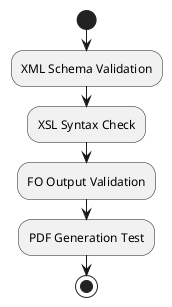
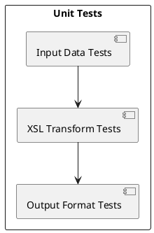
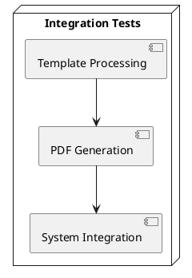
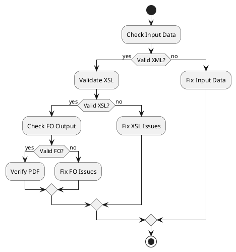

# Accounting Static Templates Documentation

## 1. Introduction

### Purpose of the Folder
The `static` folder contains XSL templates used for generating financial reports in the koalixcrm accounting module. These templates transform accounting data into professionally formatted PDF documents for balance sheets and profit/loss statements.

### Contents Overview
- `default_templates/`: Root folder for all report templates
  - `de/`: German language templates
    - `balancesheet.xsl`: Balance sheet template (German)
    - `profitlossstatement.xsl`: Profit/Loss statement template (German)
  - `en/`: English language templates
    - `balancesheet.xsl`: Balance sheet template (English)
    - `profitlossstatement.xsl`: Profit/Loss statement template (English)

## 2. Detailed Template Documentation

### 2.1 Balance Sheet Template (balancesheet.xsl)

#### Purpose
Generates a formatted balance sheet report showing an organization's assets, liabilities, and equity at a specific point in time.

#### Key Components
- Page Layout Configuration
  - A4 format (29.7cm × 21cm)
  - Margins: top=1.5cm, bottom=1.0cm, left=1.5cm, right=1.5cm
- Header Section
  - Company name and report title
  - Page numbering
- Data Tables
  - Assets table with account numbers and values
  - Liabilities table with account numbers and values
  - Profit/Loss summary

### 2.2 Profit/Loss Statement Template (profitlossstatement.xsl)

#### Purpose
Generates a formatted profit and loss statement showing an organization's revenues, costs, and expenses over a specific period.

#### Key Components
- Page Layout Configuration
  - A4 format (29.7cm × 21cm)
  - Margins: top=1.5cm, bottom=0.5cm, left=1.5cm, right=1.5cm
- Header Section
  - Company logo integration
  - Organization name
  - Report title
- Data Tables
  - Profit accounts (Type 'E')
  - Loss accounts (Type 'S')
  - Final profit/loss calculation

## 3. Template Customization Guidelines

### 3.1 General Customization Rules
1. Maintain the XML/XSL structure and namespaces
2. Preserve the decimal format settings for currency display
3. Keep the page layout specifications unless specifically needed
4. Follow the existing table structure for data presentation

### 3.2 Common Customization Points
1. Company Information
   - Update header text and titles
   - Modify logo placement and size
2. Styling
   - Adjust font families and sizes
   - Modify table column widths
   - Change border styles and colors
3. Currency Display
   - Update currency symbol (default: CHF)
    - Modify number formatting

## 4. Language Support

### 4.1 Available Localizations
- German (de/)
  - Full translation of all template text
  - German number formatting (decimal: , separator: .)
- English (en/)
  - Default template language
  - International number formatting

### 4.2 Adding New Languages
1. Create a new language folder (e.g., `fr/`)
2. Copy templates from `en/` folder
3. Translate all text elements:
   - Headers and titles
   - Table column names
   - Static text content
4. Update currency formats if needed

## 5. Template Usage Examples

### 5.1 Balance Sheet Implementation
```xml
<!-- Example of customizing company name -->
<fo:block font-size="13pt" font-family="BitstreamVeraSans">
    Balanancesheet of "Your Company Name"
</fo:block>
```

### 5.2 Profit/Loss Statement Implementation
```xml
<!-- Example of customizing logo -->
<fo:external-graphic content-width="6.0cm">
    <xsl:attribute name="src">
        <xsl:value-of select="your_logo_path"/>
    </xsl:attribute>
</fo:external-graphic>
```

## 6. Best Practices

### 6.1 Template Modification
- Always backup original templates before modifications
- Test changes with various data scenarios
- Maintain consistent styling across all templates
- Document any custom modifications

### 6.2 Performance Considerations
- Optimize image sizes for headers/logos
- Minimize custom fonts usage
- Keep conditional statements efficient

## 7. Troubleshooting

### 7.1 Common Issues and Solutions
1. Missing Data
   - Verify XML data structure matches template expectations
   - Check account type classifications (A, L, E, S)
   - Ensure all required fields are present in the data source

2. Formatting Issues
   - Validate decimal format settings
   - Check font availability (BitstreamVeraSans)
   - Verify table column width calculations
   - Ensure proper XML/XSL namespace declarations

3. Language Problems
   - Ensure correct template folder selection
   - Verify text encoding (UTF-8)
   - Check language-specific number formatting

### 7.2 Debug Tips
- Use XML validator tools to check input data
- Test templates with minimal dataset first
- Check XSL-FO processor logs for detailed error messages

### 8.1 Dependencies
- XSL-FO processor compatible with XSL 1.0
- BitstreamVeraSans font family
- XML data source with proper structure
- XSLT 1.0 compatible processor

### 8.2 Data Requirements
- Account Data:
  - account_number (String)
  - account_type (A: Assets, L: Liabilities, E: Earnings, S: Spending)
  - title (String)
  - sum_of_all_bookings_through_now (Decimal)

- Organization Data:
  - name (String)
  - logo_path (String)
  - currency_format (String)

### 8.3 Output Specifications
- Format: PDF
- Page Size: A4 (210mm × 297mm)
- Color Space: RGB
- Font Requirements: BitstreamVeraSans (regular, bold)
- Minimum Resolution: 300 DPI for logos

## 9. Template Validation Process

### 9.1 Validation Tools and Methods


#### Schema Validation
- XML Schema (XSD) validation for input data
- XSLT stylesheet syntax validation
- FO output structure validation
- PDF output compliance checking

#### Validation Tools
- xmllint for XML/XSD validation
- Saxon XSLT processor for stylesheet validation
- Apache FOP validator for FO output
- PDF/A compliance checker

### 9.2 Common Validation Errors
1. Schema Validation Errors
   - Invalid account types
   - Missing required fields
   - Incorrect data types
2. XSL Syntax Errors
   - Namespace issues
   - Template matching problems
   - Function usage errors
3. FO Output Errors
   - Invalid formatting objects
   - Layout conflicts
   - Region overflow issues

## 10. Testing Procedures

### 10.1 Unit Testing Templates


#### Test Cases
1. Input Validation
   - Valid/invalid account numbers
   - Currency format variations
   - Special character handling
2. Transformation Tests
   - Template variable processing
   - Calculation accuracy
   - Language-specific formatting

### 10.2 Integration Testing


#### Test Scenarios
1. End-to-End Processing
   - Complete report generation
   - Multi-language support
   - System integration points

### 10.3 Performance Testing
- Template processing time
- Memory usage monitoring
- Large dataset handling
- Concurrent processing capability

## 11. Troubleshooting Guide

### 11.1 Debug Procedures


### 11.2 Common Template Issues
1. Performance Problems
   - Template optimization techniques
   - Resource usage reduction
   - Caching strategies
2. Browser Compatibility
   - PDF viewer compatibility
   - Font rendering issues
   - Print formatting problems

### 11.3 Error Resolution Steps
1. Systematic Debugging
   - Input data verification
   - XSL transformation logging
   - Output validation checks
2. Performance Optimization
   - Template simplification
   - Resource optimization
   - Cache implementation
