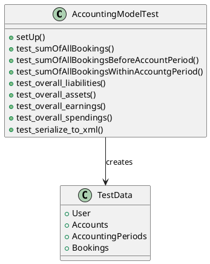
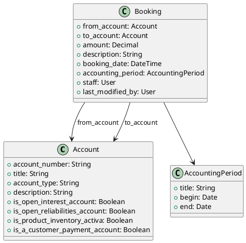
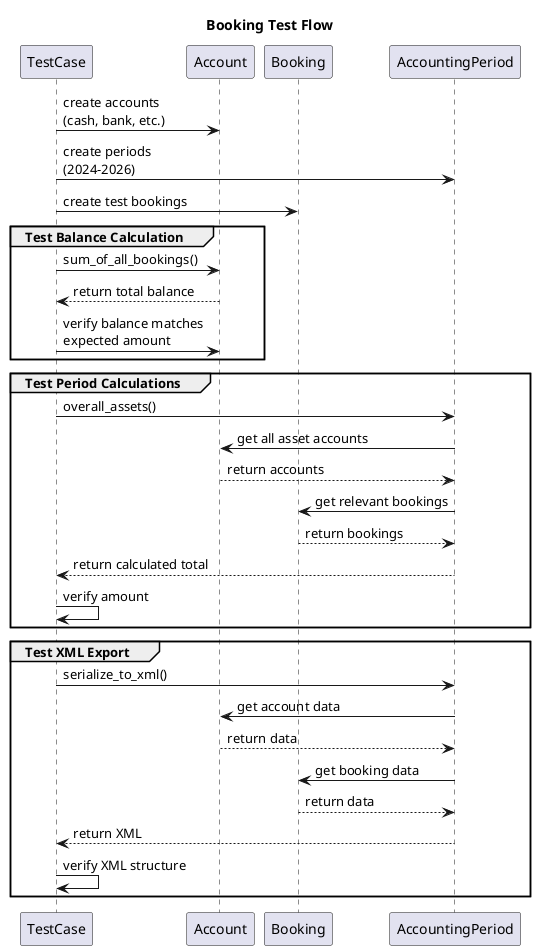
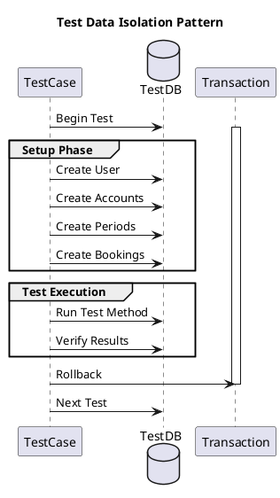
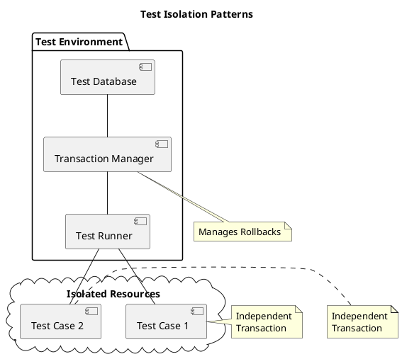

# Accounting Tests Documentation

## 1. Overview
The accounting tests verify the functionality of KoalixCRM's accounting module, focusing on account management, bookings, and accounting period calculations. The tests use Django's TestCase framework for database-driven testing.

## 2. Test Structure

### 2.1 Files
- `__init__.py`: Package initialization file
- `test_accountingModelTest.py`: Main test suite for accounting models

### 2.2 Test Coverage
The test suite covers:
- Account balance calculations
- Accounting period operations
- Booking transactions
- XML serialization for reporting

## 3. Test Setup and Data Model

### 3.1 Class Structure


### 3.2 Data Model


### 3.3 Test Flow


## 4. Test Cases

### 4.1 Account Balance Tests
- `test_sumOfAllBookings`: Verifies correct calculation of total account balances
- `test_sumOfAllBookingsBeforeAccountPeriod`: Tests balance calculations before specific accounting periods
- `test_sumOfAllBookingsWithinAccountgPeriod`: Validates balance calculations within accounting periods

### 4.2 Accounting Period Tests
- `test_overall_liabilities`: Validates total liabilities calculation
- `test_overall_assets`: Verifies total assets calculation
- `test_overall_earnings`: Tests earnings calculation
- `test_overall_spendings`: Validates spending calculations

### 4.3 Data Export Tests
- `test_serialize_to_xml`: Ensures correct XML serialization of accounting data

## 5. Test Data Setup

### 5.1 Accounts
- Cash (1000): Asset account for cash transactions
- Bank Account (1300): Asset account for bank transactions
- Bank Loan (2000): Liability account for short-term loans
- Investment Capital (2900): Liability account for long-term investment
- Spendings (3000): Spending account for purchases
- Earnings (4000): Earnings account for sales

### 5.2 Accounting Periods
- Fiscal year 2024: January 1, 2024 - December 31, 2024
- Fiscal year 2025: January 1, 2025 - December 31, 2025
- Fiscal year 2026: January 1, 2026 - December 31, 2026

### 5.3 Test Data Relationships
- Each booking connects two accounts (from_account and to_account)
- Bookings are assigned to specific accounting periods
- User records are maintained for staff and modification tracking
- Account types determine their role in financial calculations

## 6. Running Tests
```bash
python manage.py test koalixcrm.accounting.tests
```

## 7. Writing New Tests
1. Follow the existing pattern in `test_accountingModelTest.py`
2. Add test data in the `setUp` method if needed
3. Ensure proper cleanup in `tearDown` if necessary
4. Use descriptive test names that reflect the functionality being tested
5. Include assertions that verify both positive and negative cases

## 8. Test Dependencies

### 8.1 Required Models
- Django User model
- Account model
- AccountingPeriod model
- Booking model
- PDFExport utility

### 8.2 External Dependencies
- Django TestCase framework
- datetime module
- make_date_utc utility function

### 8.3 Database Requirements
- Test database with transaction support
- Proper migration setup
- Configured Django settings

## 9. Performance Considerations

1. **Test Data Volume**
   - Current test suite uses minimal test data
   - Consider adding volume tests for performance validation
   - Monitor database query count
## 10. Test Isolation

### 10.1 Database Isolation
- Uses Django's TestCase which provides automatic transaction rollback
- Each test method runs in its own transaction
- Database is reset to a clean state between tests
- Test data is isolated through Django's test database creation

### 10.2 Fixture Management
- Test data is created in setUp() method for each test run
- Uses direct object creation instead of fixtures for better control
- Consistent initial state for all test methods
- Hierarchical data setup (User -> Accounts -> Periods -> Bookings)

### 10.3 Test Data Separation


### 10.4 Resource Management
1. **Database Connections**
   - Managed by Django's test framework
   - Automatic cleanup after each test
   - Separate test database per test run

2. **Test Data Lifecycle**
   ```plantuml
   @startuml
   title Test Data Lifecycle
   
   state "Test Start" as Start
   state "Setup Data" as Setup
   state "Execute Test" as Execute
   state "Verify Results" as Verify
   state "Cleanup" as Cleanup
   
   Start --> Setup
   Setup --> Execute
   Execute --> Verify
   Verify --> Cleanup
   Cleanup --> [*]
   @enduml
   ```

### 10.5 Common Issues and Solutions
1. **Data Leakage Prevention**
   - Use unique identifiers for test data
   - Avoid global state modifications
   - Maintain data independence between tests

2. **Resource Contention**
   - Each test uses isolated database transactions
   - No shared state between test methods
   - Clean setup/teardown cycle

3. **Test Independence**
   - Each test method is self-contained
   - No dependencies between test methods
   - Explicit test data creation

### 10.6 Best Practices
1. **Setting Up Test Environment**
   - Use setUp() for common test data
   - Create only necessary test data
   - Maintain data consistency

2. **Managing Dependencies**
   - Explicit dependency creation in setUp
   - Clear separation of test scenarios
   - Avoid cross-test dependencies

3. **Data Cleanup**
   - Automatic transaction rollback
   - No manual cleanup needed
   - Consistent database state

4. **Parallel Execution**
   - Tests designed for parallel execution
   - No shared resource conflicts
   - Independent test methods

### 10.7 Debugging Isolation Issues
1. **Common Problems**
   - Data bleeding between tests
   - Inconsistent test results
   - Resource cleanup failures

2. **Solutions**
   - Verify setUp method completeness
   - Check for shared state
   - Monitor database transactions
   - Use proper test case inheritance

### 10.8 Test Isolation Patterns

